# System Architecture Analysis

## Overview

- **Project**: /home/tom/github/semcod/planfile
- **Primary Language**: python
- **Languages**: python: 52, shell: 16, javascript: 3
- **Analysis Mode**: static
- **Total Functions**: 487
- **Total Classes**: 52
- **Modules**: 71
- **Entry Points**: 404

## Architecture by Module

### htmlcov.coverage_html_cb_dd2e7eb5
- **Functions**: 77
- **File**: `coverage_html_cb_dd2e7eb5.js`

### examples.htmlcov.coverage_html_cb_dd2e7eb5
- **Functions**: 77
- **File**: `coverage_html_cb_dd2e7eb5.js`

### htmlcov.coverage_html_cb_6fb7b396
- **Functions**: 76
- **File**: `coverage_html_cb_6fb7b396.js`

### planfile.llm.adapters
- **Functions**: 18
- **Classes**: 6
- **File**: `adapters.py`

### planfile.analysis.generator
- **Functions**: 17
- **Classes**: 1
- **File**: `generator.py`

### examples.ecosystem.01_full_workflow
- **Functions**: 17
- **Classes**: 6
- **File**: `01_full_workflow.sh`

### planfile.models_v2
- **Functions**: 14
- **Classes**: 8
- **File**: `models_v2.py`

### planfile.analysis.external_tools
- **Functions**: 13
- **Classes**: 2
- **File**: `external_tools.py`

### planfile.executor_standalone
- **Functions**: 12
- **Classes**: 3
- **File**: `executor_standalone.py`

### planfile.loaders.yaml_loader
- **Functions**: 11
- **File**: `yaml_loader.py`

### planfile.loaders.cli_loader
- **Functions**: 10
- **File**: `cli_loader.py`

### planfile.ci_runner
- **Functions**: 10
- **Classes**: 3
- **File**: `ci_runner.py`

### planfile.analysis.file_analyzer
- **Functions**: 10
- **Classes**: 1
- **File**: `file_analyzer.py`

### planfile.cli.auto_loop
- **Functions**: 9
- **File**: `auto_loop.py`

### planfile.integrations.jira
- **Functions**: 9
- **Classes**: 1
- **File**: `jira.py`

### examples.ecosystem.04_llx_integration
- **Functions**: 9
- **Classes**: 2
- **File**: `04_llx_integration.py`

### planfile.integrations.base
- **Functions**: 9
- **Classes**: 4
- **File**: `base.py`

### planfile.integrations.generic
- **Functions**: 8
- **Classes**: 1
- **File**: `generic.py`

### examples.llx_validator
- **Functions**: 7
- **Classes**: 1
- **File**: `llx_validator.py`

### planfile.analysis.sprint_generator
- **Functions**: 7
- **Classes**: 1
- **File**: `sprint_generator.py`

## Key Entry Points

Main execution flows into the system:

### planfile.cli.extra_commands.add_extra_commands
> Add extra commands to the CLI app.
- **Calls**: app.command, app.command, app.command, app.command, app.command, app.command, typer.Argument, typer.Option

### examples.ecosystem.04_llx_integration.example_metric_driven_planning
> Example: Generate strategy based on actual project metrics.
- **Calls**: examples.bash-generation.verify_planfile.print, examples.bash-generation.verify_planfile.print, examples.bash-generation.verify_planfile.print, LLXIntegration, examples.bash-generation.verify_planfile.print, llx.analyze_project, examples.bash-generation.verify_planfile.print, examples.bash-generation.verify_planfile.print

### examples.ecosystem.03_proxy_routing.example_strategy_generation_with_proxy
> Example: Generate strategy using proxy for smart model routing.
- **Calls**: examples.bash-generation.verify_planfile.print, examples.bash-generation.verify_planfile.print, examples.bash-generation.verify_planfile.print, ProxyClient, examples.bash-generation.verify_planfile.print, examples.bash-generation.verify_planfile.print, examples.bash-generation.verify_planfile.print, enumerate

### planfile.cli.cmd.cmd_generate.generate_from_files_cmd
> Generate planfile from file analysis (no LLM required).
- **Calls**: typer.Argument, typer.Option, typer.Option, typer.Option, typer.Option, typer.Option, typer.Option, typer.Option

### planfile.cli.cmd.cmd_review.review_strategy_cli
> Review strategy execution and progress.
- **Calls**: typer.Argument, typer.Argument, typer.Option, typer.Option, typer.Option, typer.Option, planfile.cli.cmd.cmd_utils._load_backend_config, planfile.runner.review_strategy

### planfile.cli.auto_loop.auto_loop
> Run automated CI/CD loop: test → ticket → fix → retest.

This command will:
1. Run tests and code analysis
2. If tests fail, generate bug reports with
- **Calls**: app.command, typer.Argument, typer.Argument, typer.Option, typer.Option, typer.Option, typer.Option, typer.Option

### planfile.cli.auto_loop.ci_status
> Check current CI status without running tests.
- **Calls**: app.command, typer.Argument, console.print, results_file.exists, coverage_file.exists, list, json.loads, console.print

### examples.ecosystem.02_mcp_integration.example_mcp_session
> Example of an LLM agent using planfile MCP tools.
- **Calls**: examples.bash-generation.verify_planfile.print, examples.bash-generation.verify_planfile.print, examples.bash-generation.verify_planfile.print, examples.bash-generation.verify_planfile.print, examples.bash-generation.verify_planfile.print, examples.bash-generation.verify_planfile.print, examples.bash-generation.verify_planfile.print, examples.ecosystem.02_mcp_integration.run_mcp_tool

### examples.ecosystem.04_llx_integration.LLXIntegration._parse_llx_output
> Parse LLX analysis output.
- **Calls**: None.split, ProjectMetrics, output.strip, line.split, value.strip, int, int, float

### planfile.ci_runner.CIRunner.run_loop
> Run the main CI/CD loop.
- **Calls**: examples.bash-generation.verify_planfile.print, examples.bash-generation.verify_planfile.print, examples.bash-generation.verify_planfile.print, examples.bash-generation.verify_planfile.print, range, examples.bash-generation.verify_planfile.print, examples.bash-generation.verify_planfile.print, self.run_tests

### planfile.ci_runner.main
> CLI entry point.
- **Calls**: argparse.ArgumentParser, parser.add_argument, parser.add_argument, parser.add_argument, parser.add_argument, parser.add_argument, parser.add_argument, parser.parse_args

### planfile.models_v2.Strategy.merge
> Merge with other strategies to create a combined strategy.
- **Calls**: self.model_dump, set, merged_data.get, Strategy, merged_data.get, all_sprints.append, merged_data.get, all_gates.append

### planfile.cli.cmd.cmd_validate.validate_strategy_cli
> Validate a strategy YAML file.
- **Calls**: typer.Argument, typer.Option, planfile.loaders.yaml_loader.load_strategy_yaml, console.print, console.print, console.print, console.print, console.print

### planfile.models_v2.Strategy.to_llx_format
> Convert to LLX-compatible format.
- **Calls**: self.model_dump, isinstance, data.get, data.get, isinstance, data.get, goal.setdefault, goal.setdefault

### planfile.cli.cmd.cmd_apply.apply_strategy_cli
> Apply a strategy to create tickets.
- **Calls**: typer.Argument, typer.Argument, typer.Option, typer.Option, typer.Option, typer.Option, typer.Option, typer.Option

### planfile.cli.cmd.cmd_generate.generate_strategy_cli
> Generate strategy.yaml from project analysis + LLM.
- **Calls**: typer.Argument, typer.Option, typer.Option, typer.Option, typer.Option, typer.Option, typer.Option, console.print

### examples.ecosystem.03_proxy_routing.example_budget_tracking
> Example: Budget tracking with proxy.
- **Calls**: examples.bash-generation.verify_planfile.print, examples.bash-generation.verify_planfile.print, examples.bash-generation.verify_planfile.print, ProxyClient, examples.bash-generation.verify_planfile.print, examples.bash-generation.verify_planfile.print, examples.bash-generation.verify_planfile.print, examples.bash-generation.verify_planfile.print

### planfile.models_v2.Strategy.get_stats
> Get strategy statistics.
- **Calls**: len, sum, len, sum, hasattr, durations.append, hasattr, sum

### planfile.llm.adapters.LLMTestRunner.generate_report
> Generate a test report.
- **Calls**: report.append, report.append, report.append, results.items, report.append, results.items, None.join, report.append

### planfile.analysis.external_tools.ExternalToolRunner.parse_code2llm_output
> Parse code2llm analysis.toon.yaml output.
- **Calls**: content.split, AnalysisResults, re.search, re.search, analysis_file.exists, self._mock_code2llm_data, open, f.read

### planfile.ci_runner.CIRunner.check_strategy_completion
> Check if strategy goals are met.
- **Calls**: examples.bash-generation.verify_planfile.print, planfile.runner.review_strategy, review.get, summary.get, summary.get, issues.append, summary.get, issues.append

### planfile.analysis.generator.PlanfileGenerator.generate_from_analysis
> Generate planfile from analyzed files.
- **Calls**: self.analyzer.analyze_directory, self.generator.generate_sprints, self.generator.generate_tickets, self._extract_key_metrics, self._create_strategy_object, Path, self._generate_goal, self._generate_goals

### htmlcov.coverage_html_cb_dd2e7eb5.sortColumn
- **Calls**: htmlcov.coverage_html_cb_dd2e7eb5.getAttribute, htmlcov.coverage_html_cb_dd2e7eb5.forEach, htmlcov.coverage_html_cb_dd2e7eb5.setAttribute, htmlcov.coverage_html_cb_dd2e7eb5.indexOf, htmlcov.coverage_html_cb_dd2e7eb5.from, htmlcov.coverage_html_cb_dd2e7eb5.closest, htmlcov.coverage_html_cb_dd2e7eb5.querySelectorAll, htmlcov.coverage_html_cb_dd2e7eb5.sort

### htmlcov.coverage_html_cb_dd2e7eb5.table
- **Calls**: htmlcov.coverage_html_cb_dd2e7eb5.map, htmlcov.coverage_html_cb_dd2e7eb5.getElementById, htmlcov.coverage_html_cb_dd2e7eb5.setItem, htmlcov.coverage_html_cb_dd2e7eb5.toLowerCase, htmlcov.coverage_html_cb_dd2e7eb5.stringify, htmlcov.coverage_html_cb_dd2e7eb5.forEach, htmlcov.coverage_html_cb_dd2e7eb5.contains, htmlcov.coverage_html_cb_dd2e7eb5.includes

### htmlcov.coverage_html_cb_dd2e7eb5.table_body_rows
- **Calls**: htmlcov.coverage_html_cb_dd2e7eb5.map, htmlcov.coverage_html_cb_dd2e7eb5.getElementById, htmlcov.coverage_html_cb_dd2e7eb5.setItem, htmlcov.coverage_html_cb_dd2e7eb5.toLowerCase, htmlcov.coverage_html_cb_dd2e7eb5.stringify, htmlcov.coverage_html_cb_dd2e7eb5.forEach, htmlcov.coverage_html_cb_dd2e7eb5.contains, htmlcov.coverage_html_cb_dd2e7eb5.includes

### htmlcov.coverage_html_cb_dd2e7eb5.no_rows
- **Calls**: htmlcov.coverage_html_cb_dd2e7eb5.map, htmlcov.coverage_html_cb_dd2e7eb5.getElementById, htmlcov.coverage_html_cb_dd2e7eb5.setItem, htmlcov.coverage_html_cb_dd2e7eb5.toLowerCase, htmlcov.coverage_html_cb_dd2e7eb5.stringify, htmlcov.coverage_html_cb_dd2e7eb5.forEach, htmlcov.coverage_html_cb_dd2e7eb5.contains, htmlcov.coverage_html_cb_dd2e7eb5.includes

### htmlcov.coverage_html_cb_dd2e7eb5.footer
- **Calls**: htmlcov.coverage_html_cb_dd2e7eb5.map, htmlcov.coverage_html_cb_dd2e7eb5.getElementById, htmlcov.coverage_html_cb_dd2e7eb5.setItem, htmlcov.coverage_html_cb_dd2e7eb5.toLowerCase, htmlcov.coverage_html_cb_dd2e7eb5.stringify, htmlcov.coverage_html_cb_dd2e7eb5.forEach, htmlcov.coverage_html_cb_dd2e7eb5.contains, htmlcov.coverage_html_cb_dd2e7eb5.includes

### htmlcov.coverage_html_cb_dd2e7eb5.ratio_columns
- **Calls**: htmlcov.coverage_html_cb_dd2e7eb5.map, htmlcov.coverage_html_cb_dd2e7eb5.getElementById, htmlcov.coverage_html_cb_dd2e7eb5.setItem, htmlcov.coverage_html_cb_dd2e7eb5.toLowerCase, htmlcov.coverage_html_cb_dd2e7eb5.stringify, htmlcov.coverage_html_cb_dd2e7eb5.forEach, htmlcov.coverage_html_cb_dd2e7eb5.contains, htmlcov.coverage_html_cb_dd2e7eb5.includes

### htmlcov.coverage_html_cb_dd2e7eb5.filter_handler
- **Calls**: htmlcov.coverage_html_cb_dd2e7eb5.map, htmlcov.coverage_html_cb_dd2e7eb5.getElementById, htmlcov.coverage_html_cb_dd2e7eb5.setItem, htmlcov.coverage_html_cb_dd2e7eb5.toLowerCase, htmlcov.coverage_html_cb_dd2e7eb5.stringify, htmlcov.coverage_html_cb_dd2e7eb5.forEach, htmlcov.coverage_html_cb_dd2e7eb5.contains, htmlcov.coverage_html_cb_dd2e7eb5.includes

### htmlcov.coverage_html_cb_6fb7b396.sortColumn
- **Calls**: htmlcov.coverage_html_cb_6fb7b396.getAttribute, htmlcov.coverage_html_cb_6fb7b396.forEach, htmlcov.coverage_html_cb_6fb7b396.setAttribute, htmlcov.coverage_html_cb_6fb7b396.indexOf, htmlcov.coverage_html_cb_6fb7b396.from, htmlcov.coverage_html_cb_6fb7b396.closest, htmlcov.coverage_html_cb_6fb7b396.querySelectorAll, htmlcov.coverage_html_cb_6fb7b396.sort

## Process Flows

Key execution flows identified:

### Flow 1: add_extra_commands
```
add_extra_commands [planfile.cli.extra_commands]
```

### Flow 2: example_metric_driven_planning
```
example_metric_driven_planning [examples.ecosystem.04_llx_integration]
  └─ →> print
  └─ →> print
```

### Flow 3: example_strategy_generation_with_proxy
```
example_strategy_generation_with_proxy [examples.ecosystem.03_proxy_routing]
  └─ →> print
  └─ →> print
```

### Flow 4: generate_from_files_cmd
```
generate_from_files_cmd [planfile.cli.cmd.cmd_generate]
```

### Flow 5: review_strategy_cli
```
review_strategy_cli [planfile.cli.cmd.cmd_review]
```

### Flow 6: auto_loop
```
auto_loop [planfile.cli.auto_loop]
```

### Flow 7: ci_status
```
ci_status [planfile.cli.auto_loop]
```

### Flow 8: example_mcp_session
```
example_mcp_session [examples.ecosystem.02_mcp_integration]
  └─ →> print
  └─ →> print
```

### Flow 9: _parse_llx_output
```
_parse_llx_output [examples.ecosystem.04_llx_integration.LLXIntegration]
```

### Flow 10: run_loop
```
run_loop [planfile.ci_runner.CIRunner]
  └─ →> print
  └─ →> print
```

## Key Classes

### planfile.analysis.generator.PlanfileGenerator
> Generate comprehensive planfile from file analysis.
- **Methods**: 17
- **Key Methods**: planfile.analysis.generator.PlanfileGenerator.__init__, planfile.analysis.generator.PlanfileGenerator.generate_with_external_tools, planfile.analysis.generator.PlanfileGenerator._external_to_internal_analysis, planfile.analysis.generator.PlanfileGenerator._extract_external_metrics, planfile.analysis.generator.PlanfileGenerator.generate_from_analysis, planfile.analysis.generator.PlanfileGenerator.generate_from_current_project, planfile.analysis.generator.PlanfileGenerator._extract_key_metrics, planfile.analysis.generator.PlanfileGenerator._generate_goal, planfile.analysis.generator.PlanfileGenerator._generate_goals, planfile.analysis.generator.PlanfileGenerator._generate_quality_gates

### planfile.analysis.external_tools.ExternalToolRunner
> Runner for external code analysis tools.
- **Methods**: 11
- **Key Methods**: planfile.analysis.external_tools.ExternalToolRunner.__init__, planfile.analysis.external_tools.ExternalToolRunner.run_all, planfile.analysis.external_tools.ExternalToolRunner.run_code2llm, planfile.analysis.external_tools.ExternalToolRunner.run_vallm, planfile.analysis.external_tools.ExternalToolRunner.run_redup, planfile.analysis.external_tools.ExternalToolRunner.parse_code2llm_output, planfile.analysis.external_tools.ExternalToolRunner.parse_vallm_output, planfile.analysis.external_tools.ExternalToolRunner.parse_redup_output, planfile.analysis.external_tools.ExternalToolRunner._mock_code2llm_data, planfile.analysis.external_tools.ExternalToolRunner._mock_vallm_data

### planfile.analysis.file_analyzer.FileAnalyzer
> Analyzes YAML/JSON files to extract issues and metrics.
- **Methods**: 10
- **Key Methods**: planfile.analysis.file_analyzer.FileAnalyzer.__init__, planfile.analysis.file_analyzer.FileAnalyzer.analyze_file, planfile.analysis.file_analyzer.FileAnalyzer._analyze_toon, planfile.analysis.file_analyzer.FileAnalyzer._analyze_yaml, planfile.analysis.file_analyzer.FileAnalyzer._analyze_json, planfile.analysis.file_analyzer.FileAnalyzer._analyze_text, planfile.analysis.file_analyzer.FileAnalyzer._extract_from_yaml_structure, planfile.analysis.file_analyzer.FileAnalyzer._extract_from_json_structure, planfile.analysis.file_analyzer.FileAnalyzer.analyze_directory, planfile.analysis.file_analyzer.FileAnalyzer._generate_summary

### planfile.models_v2.Strategy
> Main strategy configuration - simplified and more flexible.
- **Methods**: 10
- **Key Methods**: planfile.models_v2.Strategy.get_task_patterns, planfile.models_v2.Strategy.get_sprint, planfile.models_v2.Strategy.to_llx_format, planfile.models_v2.Strategy.compare, planfile.models_v2.Strategy.merge, planfile.models_v2.Strategy.export, planfile.models_v2.Strategy.get_stats, planfile.models_v2.Strategy.load_flexible, planfile.models_v2.Strategy._convert_old_format, planfile.models_v2.Strategy.to_yaml
- **Inherits**: BaseModel

### planfile.ci_runner.CIRunner
> CI/CD runner with automated bug-fix loop.
- **Methods**: 9
- **Key Methods**: planfile.ci_runner.CIRunner.__init__, planfile.ci_runner.CIRunner.run_tests, planfile.ci_runner.CIRunner.run_code_analysis, planfile.ci_runner.CIRunner.generate_bug_report, planfile.ci_runner.CIRunner.create_bug_tickets, planfile.ci_runner.CIRunner.auto_fix_bugs, planfile.ci_runner.CIRunner.check_strategy_completion, planfile.ci_runner.CIRunner.run_loop, planfile.ci_runner.CIRunner.save_results

### planfile.integrations.jira.JiraBackend
> Jira integration backend.
- **Methods**: 9
- **Key Methods**: planfile.integrations.jira.JiraBackend.__init__, planfile.integrations.jira.JiraBackend._validate_config, planfile.integrations.jira.JiraBackend._map_priority_to_jira, planfile.integrations.jira.JiraBackend._map_task_type_to_jira, planfile.integrations.jira.JiraBackend.create_ticket, planfile.integrations.jira.JiraBackend.update_ticket, planfile.integrations.jira.JiraBackend.get_ticket, planfile.integrations.jira.JiraBackend.list_tickets, planfile.integrations.jira.JiraBackend.search_tickets
- **Inherits**: BasePMBackend

### planfile.integrations.generic.GenericBackend
> Generic HTTP API backend for PM systems.
- **Methods**: 8
- **Key Methods**: planfile.integrations.generic.GenericBackend.__init__, planfile.integrations.generic.GenericBackend._validate_config, planfile.integrations.generic.GenericBackend._make_request, planfile.integrations.generic.GenericBackend.create_ticket, planfile.integrations.generic.GenericBackend.update_ticket, planfile.integrations.generic.GenericBackend.get_ticket, planfile.integrations.generic.GenericBackend.list_tickets, planfile.integrations.generic.GenericBackend.search_tickets
- **Inherits**: BasePMBackend

### planfile.executor_standalone.StrategyExecutor
> Standalone strategy executor.
- **Methods**: 7
- **Key Methods**: planfile.executor_standalone.StrategyExecutor.__init__, planfile.executor_standalone.StrategyExecutor._default_config, planfile.executor_standalone.StrategyExecutor.execute_strategy, planfile.executor_standalone.StrategyExecutor._execute_task, planfile.executor_standalone.StrategyExecutor._select_model, planfile.executor_standalone.StrategyExecutor._build_prompt, planfile.executor_standalone.StrategyExecutor._get_project_metrics

### planfile.analysis.sprint_generator.SprintGenerator
> Generates sprints and tickets from extracted information.
- **Methods**: 7
- **Key Methods**: planfile.analysis.sprint_generator.SprintGenerator.__init__, planfile.analysis.sprint_generator.SprintGenerator.generate_sprints, planfile.analysis.sprint_generator.SprintGenerator._create_sprint, planfile.analysis.sprint_generator.SprintGenerator._map_category_to_task_type, planfile.analysis.sprint_generator.SprintGenerator._get_highest_priority, planfile.analysis.sprint_generator.SprintGenerator._estimate_effort, planfile.analysis.sprint_generator.SprintGenerator.generate_tickets

### planfile.integrations.gitlab.GitLabBackend
> GitLab Issues integration backend.
- **Methods**: 7
- **Key Methods**: planfile.integrations.gitlab.GitLabBackend.__init__, planfile.integrations.gitlab.GitLabBackend._validate_config, planfile.integrations.gitlab.GitLabBackend.create_ticket, planfile.integrations.gitlab.GitLabBackend.update_ticket, planfile.integrations.gitlab.GitLabBackend.get_ticket, planfile.integrations.gitlab.GitLabBackend.list_tickets, planfile.integrations.gitlab.GitLabBackend.search_tickets
- **Inherits**: BasePMBackend

### planfile.integrations.github.GitHubBackend
> GitHub Issues integration backend.
- **Methods**: 7
- **Key Methods**: planfile.integrations.github.GitHubBackend.__init__, planfile.integrations.github.GitHubBackend._validate_config, planfile.integrations.github.GitHubBackend.create_ticket, planfile.integrations.github.GitHubBackend.update_ticket, planfile.integrations.github.GitHubBackend.get_ticket, planfile.integrations.github.GitHubBackend.list_tickets, planfile.integrations.github.GitHubBackend.search_tickets
- **Inherits**: BasePMBackend

### examples.llx_validator.LLXValidator
> Use LLX to validate generated code and strategies.
- **Methods**: 6
- **Key Methods**: examples.llx_validator.LLXValidator.__init__, examples.llx_validator.LLXValidator.validate_strategy, examples.llx_validator.LLXValidator.analyze_generated_code, examples.llx_validator.LLXValidator._is_llx_available, examples.llx_validator.LLXValidator._parse_llx_analysis, examples.llx_validator.LLXValidator._basic_code_analysis

### examples.ecosystem.04_llx_integration.LLXIntegration
> Integration with LLX for code analysis and model selection.
- **Methods**: 6
- **Key Methods**: examples.ecosystem.04_llx_integration.LLXIntegration.__init__, examples.ecosystem.04_llx_integration.LLXIntegration.analyze_project, examples.ecosystem.04_llx_integration.LLXIntegration._parse_llx_output, examples.ecosystem.04_llx_integration.LLXIntegration._basic_analysis, examples.ecosystem.04_llx_integration.LLXIntegration.select_model, examples.ecosystem.04_llx_integration.LLXIntegration.get_task_scope

### planfile.models.Strategy
> Main strategy configuration.
- **Methods**: 5
- **Key Methods**: planfile.models.Strategy.validate_sprint_ids, planfile.models.Strategy.get_task_patterns, planfile.models.Strategy.get_sprint, planfile.models.Strategy.model_validate_yaml, planfile.models.Strategy.model_dump_yaml
- **Inherits**: BaseModel

### planfile.integrations.base.PMBackend
> Protocol for PM system backends.
- **Methods**: 5
- **Key Methods**: planfile.integrations.base.PMBackend.create_ticket, planfile.integrations.base.PMBackend.update_ticket, planfile.integrations.base.PMBackend.get_ticket, planfile.integrations.base.PMBackend.list_tickets, planfile.integrations.base.PMBackend.search_tickets
- **Inherits**: Protocol

### planfile.llm.adapters.LocalLLMAdapter
> Adapter for local LLM servers (Ollama, LM Studio, etc.).
- **Methods**: 5
- **Key Methods**: planfile.llm.adapters.LocalLLMAdapter.__init__, planfile.llm.adapters.LocalLLMAdapter.test_strategy_generation, planfile.llm.adapters.LocalLLMAdapter._test_ollama, planfile.llm.adapters.LocalLLMAdapter._test_openai_compatible, planfile.llm.adapters.LocalLLMAdapter.get_available_models
- **Inherits**: BaseLLMAdapter

### examples.ecosystem.03_proxy_routing.ProxyClient
> Client for interacting with Proxym API.
- **Methods**: 4
- **Key Methods**: examples.ecosystem.03_proxy_routing.ProxyClient.__init__, examples.ecosystem.03_proxy_routing.ProxyClient.chat, examples.ecosystem.03_proxy_routing.ProxyClient.get_routing_decision, examples.ecosystem.03_proxy_routing.ProxyClient.get_usage_stats

### planfile.integrations.base.BasePMBackend
> Base class for PM backends with common functionality.
- **Methods**: 4
- **Key Methods**: planfile.integrations.base.BasePMBackend.__init__, planfile.integrations.base.BasePMBackend._validate_config, planfile.integrations.base.BasePMBackend.map_priority, planfile.integrations.base.BasePMBackend.prepare_metadata
- **Inherits**: ABC

### planfile.llm.adapters.LLMTestRunner
> Run tests across multiple LLM adapters.
- **Methods**: 4
- **Key Methods**: planfile.llm.adapters.LLMTestRunner.__init__, planfile.llm.adapters.LLMTestRunner.register_adapter, planfile.llm.adapters.LLMTestRunner.test_strategy_with_all_adapters, planfile.llm.adapters.LLMTestRunner.generate_report

### planfile.llm.adapters.BaseLLMAdapter
> Base class for LLM adapters.
- **Methods**: 3
- **Key Methods**: planfile.llm.adapters.BaseLLMAdapter.__init__, planfile.llm.adapters.BaseLLMAdapter.test_strategy_generation, planfile.llm.adapters.BaseLLMAdapter.get_available_models

## Data Transformation Functions

Key functions that process and transform data:

### examples.llx_validator.LLXValidator.validate_strategy
> Validate a strategy file using LLX.
- **Output to**: self._is_llx_available, subprocess.run, str, str

### examples.llx_validator.LLXValidator._parse_llx_analysis
> Parse LLX analysis output.
- **Output to**: None.split, output.strip, line.split, value.strip, key.strip

### planfile.examples.example_validate_strategy
> Load and validate an existing strategy.
- **Output to**: planfile.runner.load_valid_strategy, examples.bash-generation.verify_planfile.print, examples.bash-generation.verify_planfile.print, examples.bash-generation.verify_planfile.print, len

### planfile.loaders.yaml_loader._validate_sprints
> Validate sprint section.
- **Output to**: set, enumerate, issues.append, sprint_ids.add, issues.append

### planfile.loaders.yaml_loader._validate_gates
> Validate quality gates section.
- **Output to**: enumerate, issues.append, issues.append, issues.append

### planfile.loaders.yaml_loader._validate_task_patterns
> Validate task patterns section.
- **Output to**: None.items, enumerate, issues.append, issues.append, issues.append

### planfile.loaders.yaml_loader.validate_strategy_schema
> Validate strategy YAML file and return list of issues.

Args:
    file_path: Path to strategy YAML f
- **Output to**: planfile.loaders.yaml_loader._check_required_keys, planfile.loaders.yaml_loader._validate_sprints, planfile.loaders.yaml_loader._validate_gates, planfile.loaders.yaml_loader._validate_task_patterns, planfile.loaders.yaml_loader.load_yaml

### planfile.analysis.external_tools.ExternalToolRunner.parse_code2llm_output
> Parse code2llm analysis.toon.yaml output.
- **Output to**: content.split, AnalysisResults, re.search, re.search, analysis_file.exists

### planfile.analysis.external_tools.ExternalToolRunner.parse_vallm_output
> Parse vallm validation.toon.yaml output.
- **Output to**: AnalysisResults, re.search, validation_file.exists, self._mock_vallm_data, open

### planfile.analysis.external_tools.ExternalToolRunner.parse_redup_output
> Parse redup duplication.toon.yaml output.
- **Output to**: AnalysisResults, re.search, re.search, dup_file.exists, self._mock_redup_data

### planfile.analysis.generator.PlanfileGenerator._parse_effort
- **Output to**: parse_effort

### planfile.cli.auto_loop._validate_strategy
> Validate strategy file exists.
- **Output to**: strategy.exists, console.print, typer.Exit

### planfile.llm.generator._parse_strategy_response
> Parse LLM YAML response into Strategy model.
- **Output to**: planfile.llm.generator._fix_yaml_formatting, yaml.safe_load, Strategy, None.split, None.split

### planfile.llm.generator._fix_yaml_formatting
> Fix common YAML formatting issues from LLM responses.
- **Output to**: yaml_text.split, enumerate, None.join, fixed_lines.append, prev_line.startswith

### planfile.models_v2.ModelHints.convert_str_to_tier
- **Output to**: field_validator, isinstance

### planfile.models_v2.Sprint.convert_tasks
- **Output to**: field_validator, isinstance, isinstance, tasks.append, tasks.append

### planfile.models_v2.Strategy.to_llx_format
> Convert to LLX-compatible format.
- **Output to**: self.model_dump, isinstance, data.get, data.get, isinstance

### planfile.models_v2.Strategy._convert_old_format
> Convert old format with separate task patterns to new format.
- **Output to**: data.get, sprint.get, sprint.pop, sprint.pop, None.get

### planfile.integrations.gitlab.GitLabBackend._validate_config
> Validate GitLab configuration.
- **Output to**: self.config.get, ValueError, self.config.get, ValueError

### planfile.models.Strategy.validate_sprint_ids
> Ensure sprint IDs are unique.
- **Output to**: validator, len, len, ValueError, set

### planfile.models.Strategy.model_validate_yaml
> Load strategy from YAML string.
- **Output to**: yaml.safe_load, cls.model_validate, isinstance, obj.items, isinstance

### planfile.integrations.jira.JiraBackend._validate_config
> Validate Jira configuration.
- **Output to**: self.config.get, ValueError, self.config.get, ValueError, self.config.get

### planfile.integrations.github.GitHubBackend._validate_config
> Validate GitHub configuration.
- **Output to**: self.config.get, ValueError, self.config.get, ValueError, ValueError

### planfile.integrations.generic.GenericBackend._validate_config
> Validate generic backend configuration.
- **Output to**: self.config.get, ValueError

### planfile.cli.cmd.cmd_utils._load_and_validate_strategy
> Load and validate strategy file.
- **Output to**: planfile.loaders.yaml_loader.load_strategy_yaml, console.print, console.print, typer.Exit

## Behavioral Patterns

### recursion_extract_from_yaml_structure
- **Type**: recursion
- **Confidence**: 0.90
- **Functions**: planfile.analysis.parsers.yaml_parser.extract_from_yaml_structure

## Public API Surface

Functions exposed as public API (no underscore prefix):

- `planfile.cli.extra_commands.add_extra_commands` - 118 calls
- `examples.ecosystem.04_llx_integration.example_metric_driven_planning` - 57 calls
- `examples.ecosystem.03_proxy_routing.example_strategy_generation_with_proxy` - 56 calls
- `planfile.cli.cmd.cmd_generate.generate_from_files_cmd` - 45 calls
- `planfile.cli.cmd.cmd_review.review_strategy_cli` - 40 calls
- `planfile.cli.auto_loop.auto_loop` - 39 calls
- `planfile.analysis.parsers.text_parser.analyze_text` - 30 calls
- `planfile.cli.auto_loop.ci_status` - 27 calls
- `examples.ecosystem.02_mcp_integration.example_mcp_session` - 26 calls
- `planfile.ci_runner.CIRunner.run_loop` - 25 calls
- `planfile.ci_runner.main` - 24 calls
- `planfile.runner.run_strategy` - 23 calls
- `planfile.models_v2.Strategy.merge` - 23 calls
- `planfile.cli.extra_commands.compare_strategies` - 22 calls
- `planfile.cli.cmd.cmd_validate.validate_strategy_cli` - 21 calls
- `planfile.models_v2.Strategy.to_llx_format` - 20 calls
- `planfile.cli.cmd.cmd_apply.apply_strategy_cli` - 20 calls
- `planfile.cli.cmd.cmd_generate.generate_strategy_cli` - 20 calls
- `planfile.analysis.parsers.yaml_parser.analyze_yaml` - 20 calls
- `examples.ecosystem.03_proxy_routing.example_budget_tracking` - 19 calls
- `planfile.models_v2.Strategy.get_stats` - 18 calls
- `planfile.llm.adapters.LLMTestRunner.generate_report` - 18 calls
- `planfile.loaders.yaml_loader.load_strategy_yaml` - 17 calls
- `planfile.analysis.external_tools.ExternalToolRunner.parse_code2llm_output` - 17 calls
- `planfile.loaders.cli_loader.export_results_to_markdown` - 15 calls
- `planfile.ci_runner.CIRunner.check_strategy_completion` - 15 calls
- `planfile.analysis.generator.PlanfileGenerator.generate_from_analysis` - 15 calls
- `planfile.cli.cmd.cmd_utils.get_backend` - 15 calls
- `planfile.analysis.parsers.toon_parser.analyze_toon` - 15 calls
- `htmlcov.coverage_html_cb_dd2e7eb5.sortColumn` - 15 calls
- `htmlcov.coverage_html_cb_dd2e7eb5.table` - 15 calls
- `htmlcov.coverage_html_cb_dd2e7eb5.table_body_rows` - 15 calls
- `htmlcov.coverage_html_cb_dd2e7eb5.no_rows` - 15 calls
- `htmlcov.coverage_html_cb_dd2e7eb5.footer` - 15 calls
- `htmlcov.coverage_html_cb_dd2e7eb5.ratio_columns` - 15 calls
- `htmlcov.coverage_html_cb_dd2e7eb5.filter_handler` - 15 calls
- `htmlcov.coverage_html_cb_6fb7b396.sortColumn` - 15 calls
- `htmlcov.coverage_html_cb_6fb7b396.table` - 15 calls
- `htmlcov.coverage_html_cb_6fb7b396.table_body_rows` - 15 calls
- `htmlcov.coverage_html_cb_6fb7b396.no_rows` - 15 calls

## System Interactions

How components interact:

```mermaid
graph TD
    add_extra_commands --> command
    example_metric_drive --> print
    example_metric_drive --> LLXIntegration
    example_strategy_gen --> print
    example_strategy_gen --> ProxyClient
    generate_from_files_ --> Argument
    generate_from_files_ --> Option
    review_strategy_cli --> Argument
    review_strategy_cli --> Option
    auto_loop --> command
    auto_loop --> Argument
    auto_loop --> Option
    ci_status --> command
    ci_status --> Argument
    ci_status --> print
    ci_status --> exists
    example_mcp_session --> print
    _parse_llx_output --> split
    _parse_llx_output --> ProjectMetrics
    _parse_llx_output --> strip
    run_loop --> print
    run_loop --> range
    main --> ArgumentParser
    main --> add_argument
    merge --> model_dump
    merge --> set
    merge --> get
    merge --> Strategy
    validate_strategy_cl --> Argument
    validate_strategy_cl --> Option
```



## Reverse Engineering Guidelines

1. **Entry Points**: Start analysis from the entry points listed above
2. **Core Logic**: Focus on classes with many methods
3. **Data Flow**: Follow data transformation functions
4. **Process Flows**: Use the flow diagrams for execution paths
5. **API Surface**: Public API functions reveal the interface

## Context for LLM

Maintain the identified architectural patterns and public API surface when suggesting changes.