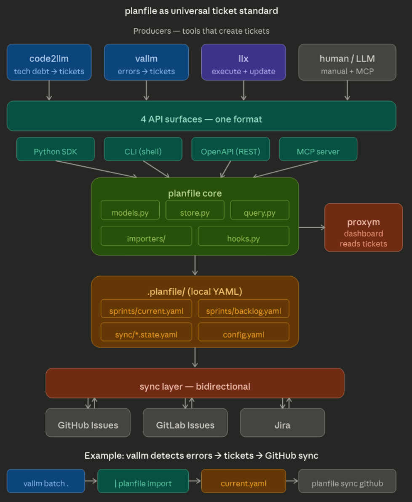
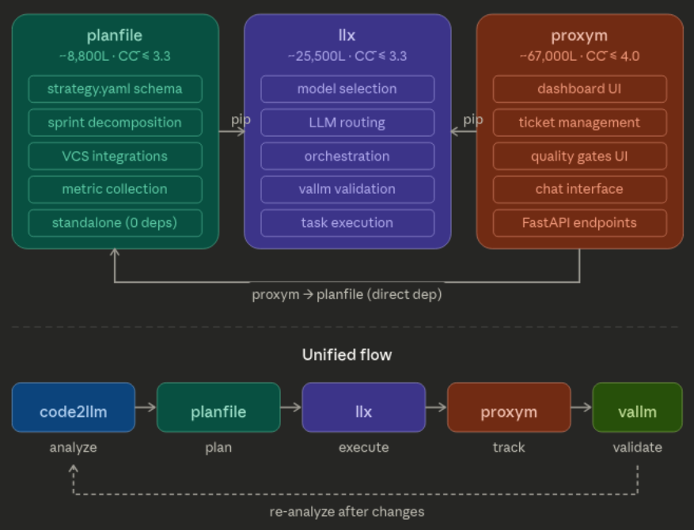

now:



before:



# Planfile

[](https://python.org)
[](https://opensource.org/licenses/Apache-2.0)
[](https://pypi.org/project/planfile/)
[](https://pypi.org/project/planfile/)
[](https://github.com/semcod/planfile/actions)
[](https://codecov.io/gh/semcod/planfile)
[](https://github.com/semcod/planfile)
[](https://github.com/semcod/planfile)
[](https://github.com/semcod/planfile)
[](https://github.com/psf/black)
[](https://github.com/astral-sh/ruff)
[](https://mypy.readthedocs.io/)
[](https://pydantic.dev)
[](https://www.docker.com)
[](https://strategy.readthedocs.io)
[](https://github.com/semcod/planfile/issues)
[](https://github.com/semcod/planfile/pulls)
[](https://github.com/semcod/planfile/stargazers)
[](https://github.com/semcod/planfile/network)
[](https://github.com/semcod/planfile/commits/main)
[](https://github.com/semcod/planfile/releases)
[](https://github.com/semcod/planfile)

**Planfile** is an SDLC automation platform that provides strategic project management with CI/CD integration and automated bug-fix loops. It manages sprints and strategies across external ticket systems like GitHub, Jira, and GitLab.

## 📊 Project Metrics

- **56 modules** with **395 functions**
- **Cyclomatic Complexity**: CC̄=4.1 (improved from 4.2)
- **Critical functions**: 15 (target: ≤4)
- **Zero circular dependencies**
- **Languages**: Python (53), Shell (17), JavaScript (3)

## ✨ Features

- 🎯 **Strategy Modeling**: Define strategies and sprints in YAML with task patterns
- 🔄 **Automated CI/CD Loop**: Test → Ticket → Fix → Retest automation
- 🔌 **Multi-Backend Support**: Integrates with GitHub Issues, Jira, GitLab, and generic HTTP APIs
- 🤖 **LLM-Powered**: AI-driven bug reports and auto-fix capabilities
- 📊 **Progress Tracking**: Review strategy execution with detailed metrics
- 🚀 **CLI Tool**: Easy-to-use command-line interface for applying and reviewing strategies
- 🎨 **Rich Output**: Beautiful terminal output with progress bars and tables
- 🐳 **Docker Support**: Containerized deployment with Ollama integration
- 🔧 **Extensible**: Easy to add new backends and custom integrations
- 🔍 **Code Analysis**: Integration with external tools (code2llm, vallm, redup)
- 🌐 **MCP Server**: Model Context Protocol server integration
- 🤖 **LLX Integration**: Advanced code analysis and model selection
- 🌉 **Proxy Routing**: Smart model routing via Proxym API
- 📈 **Metrics-Driven**: Project metrics analysis for informed planning

## 📦 Installation

```bash
# Basic installation
pip install planfile

# With all backend integrations
pip install planfile[all]

# Or with specific backends
pip install planfile[github,jira]
pip install planfile[gitlab]
```

## 🚀 Quick Start

### 1. Create a Strategy

Create a `strategy.yaml` file:

```yaml
name: "My Project Strategy"
project_type: "web"
domain: "fintech"
goal: "Launch a secure payment processing platform"

sprints:
  - id: 1
    name: "Core Infrastructure"
    length_days: 14
    objectives:
      - Set up project structure
      - Implement authentication
    tasks:
      - type: "feature"
        title: "Setup project structure"
        description: "Create basic project layout and configuration"
        estimate: 2
        priority: "high"

  - id: 2
    name: "Payment Processing"
    length_days: 21
    objectives:
      - Implement payment gateway
      - Add security measures
    tasks:
      - type: "feature"
        title: "Payment gateway integration"
        description: "Integrate with payment provider API"
        estimate: 5
        priority: "critical"
```

### 2. Configure Environment

```bash
# GitHub
export GITHUB_TOKEN=your_token
export GITHUB_REPO=owner/repo

# Jira
export JIRA_URL=https://company.atlassian.net
export JIRA_EMAIL=your@email.com
export JIRA_TOKEN=your_token
export JIRA_PROJECT=PROJ

# GitLab
export GITLAB_TOKEN=your_token
export GITLAB_PROJECT_ID=123
```

### 3. Run CI/CD Auto-Loop

```bash
# Run automated bug-fix loop
planfile auto loop \
  --strategy ./strategy.yaml \
  --project . \
  --backend github \
  --max-iterations 5 \
  --auto-fix

# Check CI status
planfile auto ci-status

# Review strategy progress
planfile strategy review \
  --strategy ./strategy.yaml \
  --project . \
  --backend github
```

### 4. Using Makefile

```bash
# Run CI loop with strategy
make ci-loop STRATEGY=strategy.yaml BACKENDS=github MAX_ITERATIONS=5

# Run examples
make example-github
make example-jira

# Full pipeline
make pipeline-docker
```

## 🔄 CI/CD Automation

Planfile provides complete automation for the bug-fix lifecycle:

1. **Test Execution**: Run your test suite
2. **Bug Detection**: Identify failing tests and code issues
3. **AI Analysis**: Generate detailed bug reports using LLM
4. **Ticket Creation**: Create tickets in your PM system
5. **Auto-Fix**: Optionally fix bugs automatically with AI
6. **Verification**: Re-run tests to verify fixes
7. **Loop**: Repeat until all tests pass

## 🐳 Docker Support

```bash
# Build Docker image
make docker-build

# Run with Docker Compose
docker-compose up -d

# Run auto-loop in container
docker-compose exec sprintstrat-runner planfile auto loop \
  --strategy /app/strategy.yaml \
  --project /workspace \
  --backend github \
  --max-iterations 5
```

## 📚 Documentation

- [CI/CD Integration Guide](docs/CI_CD_INTEGRATION.md)
- [API Reference](docs/API.md)
- [CLI Reference](docs/CLI.md)
- [Examples](examples/)
- [Architecture Overview](docs/summaries/)
- [Migration Guide](MIGRATION_GUIDE.md)
- [Changelog](CHANGELOG.md)

## 🔧 Configuration

### Strategy Schema (v2)

The `strategy.yaml` file supports:

- **Sprints**: Time-boxed development periods with embedded tasks
- **Goals**: Project objectives with success criteria
- **Quality Gates**: Definition of done criteria
- **Model Hints**: AI model suggestions for different phases

### Example Strategy (v2)

```yaml
name: "My Project Strategy"
project_type: "web"
domain: "fintech"
goal:
  title: "Launch secure payment platform"
  description: "Build and deploy a secure payment processing system"
  success_metrics:
    - "99.9% uptime"
    - "<100ms response time"

sprints:
  - id: 1
    name: "Core Infrastructure"
    length_days: 14
    objectives: ["Set up project structure", "Implement authentication"]
    tasks:
      - type: "feature"
        title: "Setup project structure"
        description: "Create basic project layout and configuration"
        estimate: 2
        priority: "high"
        model_hints:
          small: "gpt-4o-mini"
          large: "gpt-4o"

quality_gates:
  - name: "Code Coverage"
    criteria: ["coverage >= 80%"]
    required: true
```

### Backend Configuration

Each backend requires specific configuration:

```yaml
# GitHub backend
github:
  token: ${GITHUB_TOKEN}
  repo: ${GITHUB_REPO}

# Jira backend
jira:
  url: ${JIRA_URL}
  email: ${JIRA_EMAIL}
  token: ${JIRA_TOKEN}
  project: ${JIRA_PROJECT}
```

## 🤖 AI Integration

Planfile integrates with multiple LLM services:

- **Multiple Providers**: OpenAI, Anthropic, LiteLLM, Local LLMs
- **Smart Routing**: Automatic model selection via Proxym proxy
- **Code Analysis**: LLX integration for advanced metrics
- **Auto-Fix**: Automatic code generation for bug fixes
- **Strategy Generation**: AI-powered strategy creation

```bash
# Enable AI features
export OPENAI_API_KEY=your_key
export ANTHROPIC_API_KEY=your_key
export PROXY_API_URL=http://localhost:9999

# Run with auto-fix
planfile auto loop --strategy strategy.yaml --auto-fix

# Generate strategy with AI
planfile strategy generate ./my-project --model gpt-4o
```

## 📚 Examples

Explore the `examples/` directory for comprehensive use cases:

### Available Examples
```bash
# List all available examples
planfile examples list

# Run a specific example
planfile examples run code2llm

# Run all examples (with timeout protection)
planfile examples run --all
```

### Featured Examples

- **[code2llm](examples/code2llm/)** - Code analysis with LLM integration
- **[bash-generation](examples/bash-generation/)** - Generate bash scripts from strategies  
- **[cli-commands](examples/cli-commands/)** - CLI usage patterns
- **[advanced-usage](examples/advanced-usage/)** - CI/CD integration examples
- **[interactive-tests](examples/interactive-tests/)** - Interactive mode demonstrations
- **[ecosystem](examples/ecosystem/)** - MCP, LLX, and proxy routing integrations

### Quick Example

```yaml
# examples/quick-start.yaml
name: "Quick Start Demo"
project_type: "web"
domain: "demo"
goal: "Demonstrate planfile capabilities"

sprints:
  - id: 1
    name: "Setup"
    length_days: 7
    tasks:
      - type: "feature"
        title: "Initialize project"
        description: "Create basic project structure"
        estimate: 1
        priority: "high"
```

For more examples, see the [examples directory](examples/).

### Web Project Strategy

```yaml
name: "E-commerce MVP"
project_type: "web"
domain: "ecommerce"
goal: "Launch minimum viable e-commerce platform"

sprints:
  - id: 1
    name: "Foundation"
    length_days: 10
    tasks:
      - type: "feature"
        title: "Setup project structure"
        estimate: 1
      - type: "feature"
        title: "Database schema"
        estimate: 3
```

### Mobile App Strategy

```yaml
name: "Mobile App MVP"
project_type: "mobile"
domain: "healthcare"
goal: "Launch health tracking mobile app"

sprints:
  - id: 1
    name: "Core Features"
    length_days: 14
    tasks:
      - type: "feature"
        title: "User authentication"
        estimate: 3
      - type: "feature"
        title: "Health data tracking"
        estimate: 5
```

## 🔗 Integrations

### Version Control

- **GitHub**: Issues, Projects, Actions
- **GitLab**: Issues, CI/CD, Merge Requests
- **Bitbucket**: Issues, Pipelines

### Project Management

- **Jira**: Issues, Epics, Sprints
- **Linear**: Issues, Projects, Teams
- **ClickUp**: Tasks, Lists, Spaces
- **Asana**: Tasks, Projects, Portfolios

### CI/CD Platforms

- **GitHub Actions**: Workflow automation
- **GitLab CI**: Pipeline integration
- **Jenkins**: Build automation
- **Azure DevOps**: Release management

## 🛠️ Development

### Setup Development Environment

```bash
# Clone repository
git clone https://github.com/semcod/planfile
cd strategy

# Create virtual environment
python -m venv .venv
source .venv/bin/activate  # On Windows: .venv\Scripts\activate

# Install in development mode
pip install -e ".[dev]"

# Run tests
pytest tests/ -v

# Run linting
ruff check src/ tests/
ruff format src/ tests/
```

### Project Structure

```
planfile/
├── planfile/              # Main package
│   ├── analysis/          # Code analysis components
│   │   ├── external_tools.py    # External tool integrations
│   │   ├── generator.py         # Strategy generation
│   │   ├── file_analyzer.py     # File analysis
│   │   ├── sprint_generator.py  # Sprint generation
│   │   ├── parsers/             # YAML/JSON/Toon parsers
│   │   └── generators/          # Metrics extractors
│   ├── cli/               # CLI commands
│   │   ├── cmd/           # Core commands (init, generate, apply, etc.)
│   │   ├── auto_loop.py   # CI/CD automation
│   │   └── extra_commands.py # Additional utilities
│   ├── integrations/      # Backend integrations
│   │   ├── github.py      # GitHub Issues
│   │   ├── jira.py        # Jira
│   │   ├── gitlab.py      # GitLab
│   │   └── generic.py     # Generic HTTP API
│   ├── llm/               # LLM integrations
│   │   ├── adapters.py    # Multiple LLM adapters
│   │   ├── client.py      # LLM client
│   │   └── generator.py   # Strategy generation
│   ├── loaders/           # Data loaders
│   │   ├── yaml_loader.py # YAML loading/saving
│   │   └── cli_loader.py  # JSON/Markdown export
│   ├── models.py          # Core data models
│   ├── models_v2.py       # Simplified models
│   ├── runner.py          # Strategy execution
│   ├── ci_runner.py       # CI/CD automation
│   └── executor_standalone.py # Standalone executor
├── examples/              # Usage examples
│   ├── quick-start/       # Basic examples
│   ├── ecosystem/         # Integration examples
│   └── advanced-usage/    # Advanced features
├── tests/                 # Test suite
├── docs/                  # Documentation
└── project/               # Project analysis output
```

## 📄 License

This project is licensed under the Apache License 2.0 - see the [LICENSE](LICENSE) file for details.

## 🤝 Contributing

Contributions are welcome! Please feel free to submit a Pull Request. For major changes, please open an issue first to discuss what you would like to change.

## 📞 Support

- 📖 [Documentation](docs/)
- 🐛 [Issue Tracker](https://github.com/semcod/planfile/issues)
- 💬 [Discussions](https://github.com/semcod/planfile/discussions)

## 🏆 Acknowledgments

- Built with [Typer](https://typer.tiangolo.com/) for CLI
- Styled with [Rich](https://rich.readthedocs.io/) for terminal output
- Validated with [Pydantic](https://pydantic-docs.helpmanual.io/) for data models

---

**Planfile** - Your strategic partner in SDLC automation. 🚀

## License

Apache License 2.0 - see [LICENSE](LICENSE) for details.

## Author

Created by **Tom Sapletta** - [tom@sapletta.com](mailto:tom@sapletta.com)
