# System Architecture Analysis

## Overview

- **Project**: /home/tom/github/semcod/planfile/examples
- **Primary Language**: python
- **Languages**: python: 11, shell: 8
- **Analysis Mode**: static
- **Total Functions**: 76
- **Total Classes**: 8
- **Modules**: 19
- **Entry Points**: 67

## Architecture by Module

### ecosystem.01_full_workflow
- **Functions**: 17
- **Classes**: 6
- **File**: `01_full_workflow.sh`

### ecosystem.04_llx_integration
- **Functions**: 9
- **Classes**: 2
- **File**: `04_llx_integration.py`

### integrated-functionality.integrated_functionality_examples
- **Functions**: 8
- **File**: `integrated_functionality_examples.py`

### llx_validator
- **Functions**: 7
- **Classes**: 1
- **File**: `llx_validator.py`

### ecosystem.03_proxy_routing
- **Functions**: 7
- **Classes**: 1
- **File**: `03_proxy_routing.py`

### advanced-usage.advanced_usage_examples
- **Functions**: 7
- **File**: `advanced_usage_examples.py`

### external-tools.external_tools_examples
- **Functions**: 6
- **File**: `external_tools_examples.py`

### ecosystem.02_mcp_integration
- **Functions**: 6
- **File**: `02_mcp_integration.py`

### quick-start.quick_start_examples
- **Functions**: 6
- **File**: `quick_start_examples.py`

### bash-generation.verify_planfile
- **Functions**: 4
- **File**: `verify_planfile.sh`

### comprehensive_example
- **Functions**: 2
- **File**: `comprehensive_example.py`

### cli-commands.cli_command_examples
- **Functions**: 2
- **File**: `cli_command_examples.py`

### summary
- **Functions**: 1
- **File**: `summary.py`

### validate_with_llx
- **Functions**: 1
- **File**: `validate_with_llx.sh`

## Key Entry Points

Main execution flows into the system:

### ecosystem.04_llx_integration.example_metric_driven_planning
> Example: Generate strategy based on actual project metrics.
- **Calls**: bash-generation.verify_planfile.print, bash-generation.verify_planfile.print, bash-generation.verify_planfile.print, LLXIntegration, bash-generation.verify_planfile.print, llx.analyze_project, bash-generation.verify_planfile.print, bash-generation.verify_planfile.print

### ecosystem.03_proxy_routing.example_strategy_generation_with_proxy
> Example: Generate strategy using proxy for smart model routing.
- **Calls**: bash-generation.verify_planfile.print, bash-generation.verify_planfile.print, bash-generation.verify_planfile.print, ProxyClient, bash-generation.verify_planfile.print, bash-generation.verify_planfile.print, bash-generation.verify_planfile.print, enumerate

### summary.create_summary
> Create a summary of all changes made.
- **Calls**: bash-generation.verify_planfile.print, bash-generation.verify_planfile.print, bash-generation.verify_planfile.print, bash-generation.verify_planfile.print, bash-generation.verify_planfile.print, bash-generation.verify_planfile.print, bash-generation.verify_planfile.print, bash-generation.verify_planfile.print

### comprehensive_example.main
> Run comprehensive examples.
- **Calls**: bash-generation.verify_planfile.print, bash-generation.verify_planfile.print, bash-generation.verify_planfile.print, Path, bash-generation.verify_planfile.print, sorted, bash-generation.verify_planfile.print, comprehensive_example.run_command

### advanced-usage.advanced_usage_examples.example_4_batch_processing
> Example 4: Process multiple directories.
- **Calls**: bash-generation.verify_planfile.print, bash-generation.verify_planfile.print, bash-generation.verify_planfile.print, directories.items, bash-generation.verify_planfile.print, bash-generation.verify_planfile.print, bash-generation.verify_planfile.print, results.items

### advanced-usage.advanced_usage_examples.example_6_workflow_automation
> Example 6: Automated workflow for CI/CD.
- **Calls**: bash-generation.verify_planfile.print, bash-generation.verify_planfile.print, bash-generation.verify_planfile.print, bash-generation.verify_planfile.print, bash-generation.verify_planfile.print, os.chmod, bash-generation.verify_planfile.print, bash-generation.verify_planfile.print

### external-tools.external_tools_examples.main
> Run all external tools examples.
- **Calls**: bash-generation.verify_planfile.print, bash-generation.verify_planfile.print, bash-generation.verify_planfile.print, external-tools.external_tools_examples.example_1_check_external_tools, bash-generation.verify_planfile.print, bash-generation.verify_planfile.print, bash-generation.verify_planfile.print, results.get

### cli-commands.cli_command_examples.main
> Demonstrate CLI commands.
- **Calls**: bash-generation.verify_planfile.print, bash-generation.verify_planfile.print, bash-generation.verify_planfile.print, os.chdir, cli-commands.cli_command_examples.run_command, cli-commands.cli_command_examples.run_command, cli-commands.cli_command_examples.run_command, cli-commands.cli_command_examples.run_command

### advanced-usage.advanced_usage_examples.example_3_iterative_refinement
> Example 3: Iteratively refine a strategy.
- **Calls**: bash-generation.verify_planfile.print, bash-generation.verify_planfile.print, bash-generation.verify_planfile.print, bash-generation.verify_planfile.print, generator.generate_from_current_project, bash-generation.verify_planfile.print, save_strategy_yaml, Strategy.load

### advanced-usage.advanced_usage_examples.main
> Run all advanced examples.
- **Calls**: bash-generation.verify_planfile.print, bash-generation.verify_planfile.print, bash-generation.verify_planfile.print, bash-generation.verify_planfile.print, bash-generation.verify_planfile.print, bash-generation.verify_planfile.print, results.items, bash-generation.verify_planfile.print

### external-tools.external_tools_examples.example_5_custom_analysis
> Example 5: Custom analysis with specific focus.
- **Calls**: bash-generation.verify_planfile.print, bash-generation.verify_planfile.print, bash-generation.verify_planfile.print, Path, output_dir.mkdir, ExternalToolRunner, runner.run_all, bash-generation.verify_planfile.print

### ecosystem.02_mcp_integration.example_mcp_session
> Example of an LLM agent using planfile MCP tools.
- **Calls**: bash-generation.verify_planfile.print, bash-generation.verify_planfile.print, bash-generation.verify_planfile.print, bash-generation.verify_planfile.print, bash-generation.verify_planfile.print, bash-generation.verify_planfile.print, bash-generation.verify_planfile.print, ecosystem.02_mcp_integration.run_mcp_tool

### ecosystem.04_llx_integration.LLXIntegration._parse_llx_output
> Parse LLX analysis output.
- **Calls**: None.split, ProjectMetrics, output.strip, line.split, value.strip, int, int, float

### external-tools.external_tools_examples.example_4_generate_strategy_with_tools
> Example 4: Generate strategy using external tools.
- **Calls**: bash-generation.verify_planfile.print, bash-generation.verify_planfile.print, bash-generation.verify_planfile.print, generator.generate_with_external_tools, bash-generation.verify_planfile.print, bash-generation.verify_planfile.print, bash-generation.verify_planfile.print, bash-generation.verify_planfile.print

### advanced-usage.advanced_usage_examples.example_5_custom_metrics
> Example 5: Add custom metrics to analysis.
- **Calls**: bash-generation.verify_planfile.print, bash-generation.verify_planfile.print, bash-generation.verify_planfile.print, FileAnalyzer, analyzer.issue_patterns.update, analyzer.analyze_directory, bash-generation.verify_planfile.print, custom_issues.items

### quick-start.quick_start_examples.main
> Run all quick start examples.
- **Calls**: bash-generation.verify_planfile.print, bash-generation.verify_planfile.print, bash-generation.verify_planfile.print, bash-generation.verify_planfile.print, bash-generation.verify_planfile.print, bash-generation.verify_planfile.print, bash-generation.verify_planfile.print, bash-generation.verify_planfile.print

### external-tools.external_tools_examples.example_2_run_individual_tools
> Example 2: Run each tool individually.
- **Calls**: bash-generation.verify_planfile.print, bash-generation.verify_planfile.print, bash-generation.verify_planfile.print, ExternalToolRunner, Path, bash-generation.verify_planfile.print, bash-generation.verify_planfile.print, bash-generation.verify_planfile.print

### integrated-functionality.integrated_functionality_examples.main
> Run all examples.
- **Calls**: bash-generation.verify_planfile.print, bash-generation.verify_planfile.print, bash-generation.verify_planfile.print, bash-generation.verify_planfile.print, bash-generation.verify_planfile.print, bash-generation.verify_planfile.print, results.items, bash-generation.verify_planfile.print

### ecosystem.03_proxy_routing.example_budget_tracking
> Example: Budget tracking with proxy.
- **Calls**: bash-generation.verify_planfile.print, bash-generation.verify_planfile.print, bash-generation.verify_planfile.print, ProxyClient, bash-generation.verify_planfile.print, bash-generation.verify_planfile.print, bash-generation.verify_planfile.print, bash-generation.verify_planfile.print

### external-tools.external_tools_examples.example_3_run_all_tools
> Example 3: Run all tools and get results.
- **Calls**: bash-generation.verify_planfile.print, bash-generation.verify_planfile.print, bash-generation.verify_planfile.print, ExternalToolRunner, runner.run_all, bash-generation.verify_planfile.print, bash-generation.verify_planfile.print, bash-generation.verify_planfile.print

### integrated-functionality.integrated_functionality_examples.example_5_strategy_stats
> Example 5: Get strategy statistics.
- **Calls**: bash-generation.verify_planfile.print, bash-generation.verify_planfile.print, bash-generation.verify_planfile.print, Strategy.load, strategy.get_stats, bash-generation.verify_planfile.print, bash-generation.verify_planfile.print, bash-generation.verify_planfile.print

### quick-start.quick_start_examples.quick_start_3
> Quick Start 3: Load and analyze a strategy.
- **Calls**: bash-generation.verify_planfile.print, bash-generation.verify_planfile.print, bash-generation.verify_planfile.print, Strategy.load, bash-generation.verify_planfile.print, strategy.get_stats, bash-generation.verify_planfile.print, bash-generation.verify_planfile.print

### advanced-usage.advanced_usage_examples.example_2_focus_area_strategies
> Example 2: Generate strategies for different focus areas.
- **Calls**: bash-generation.verify_planfile.print, bash-generation.verify_planfile.print, bash-generation.verify_planfile.print, bash-generation.verify_planfile.print, bash-generation.verify_planfile.print, generator.generate_from_current_project, save_strategy_yaml, strategy.get

### integrated-functionality.integrated_functionality_examples.example_4_export_formats
> Example 4: Export strategies to different formats.
- **Calls**: bash-generation.verify_planfile.print, bash-generation.verify_planfile.print, bash-generation.verify_planfile.print, Strategy.load, formats.items, bash-generation.verify_planfile.print, bash-generation.verify_planfile.print, bash-generation.verify_planfile.print

### advanced-usage.advanced_usage_examples.example_1_custom_file_patterns
> Example 1: Analyze with custom file patterns.
- **Calls**: bash-generation.verify_planfile.print, bash-generation.verify_planfile.print, bash-generation.verify_planfile.print, FileAnalyzer, analyzer.analyze_directory, bash-generation.verify_planfile.print, bash-generation.verify_planfile.print, bash-generation.verify_planfile.print

### integrated-functionality.integrated_functionality_examples.example_1_generate_from_files
> Example 1: Generate strategy from file analysis.
- **Calls**: bash-generation.verify_planfile.print, bash-generation.verify_planfile.print, bash-generation.verify_planfile.print, generator.generate_from_current_project, bash-generation.verify_planfile.print, bash-generation.verify_planfile.print, bash-generation.verify_planfile.print, save_strategy_yaml

### integrated-functionality.integrated_functionality_examples.example_2_template_generation
> Example 2: Generate strategy templates.
- **Calls**: bash-generation.verify_planfile.print, bash-generation.verify_planfile.print, bash-generation.verify_planfile.print, enumerate, zip, generate_template, save_strategy_yaml, bash-generation.verify_planfile.print

### integrated-functionality.integrated_functionality_examples.example_3_strategy_comparison
> Example 3: Compare strategies.
- **Calls**: bash-generation.verify_planfile.print, bash-generation.verify_planfile.print, bash-generation.verify_planfile.print, Strategy.load, Strategy.load, template1.compare, bash-generation.verify_planfile.print, bash-generation.verify_planfile.print

### integrated-functionality.integrated_functionality_examples.example_6_merge_strategies
> Example 6: Merge multiple strategies.
- **Calls**: bash-generation.verify_planfile.print, bash-generation.verify_planfile.print, bash-generation.verify_planfile.print, None.merge, bash-generation.verify_planfile.print, bash-generation.verify_planfile.print, bash-generation.verify_planfile.print, save_strategy_yaml

### integrated-functionality.integrated_functionality_examples.example_7_external_tools
> Example 7: Generate with external tools (if available).
- **Calls**: bash-generation.verify_planfile.print, bash-generation.verify_planfile.print, bash-generation.verify_planfile.print, generator.generate_with_external_tools, bash-generation.verify_planfile.print, bash-generation.verify_planfile.print, bash-generation.verify_planfile.print, save_strategy_yaml

## Process Flows

Key execution flows identified:

### Flow 1: example_metric_driven_planning
```
example_metric_driven_planning [ecosystem.04_llx_integration]
  └─ →> print
  └─ →> print
```

### Flow 2: example_strategy_generation_with_proxy
```
example_strategy_generation_with_proxy [ecosystem.03_proxy_routing]
  └─ →> print
  └─ →> print
```

### Flow 3: create_summary
```
create_summary [summary]
  └─ →> print
  └─ →> print
```

### Flow 4: main
```
main [comprehensive_example]
  └─ →> print
  └─ →> print
```

### Flow 5: example_4_batch_processing
```
example_4_batch_processing [advanced-usage.advanced_usage_examples]
  └─ →> print
  └─ →> print
```

### Flow 6: example_6_workflow_automation
```
example_6_workflow_automation [advanced-usage.advanced_usage_examples]
  └─ →> print
  └─ →> print
```

### Flow 7: example_3_iterative_refinement
```
example_3_iterative_refinement [advanced-usage.advanced_usage_examples]
  └─ →> print
  └─ →> print
```

### Flow 8: example_5_custom_analysis
```
example_5_custom_analysis [external-tools.external_tools_examples]
  └─ →> print
  └─ →> print
```

### Flow 9: example_mcp_session
```
example_mcp_session [ecosystem.02_mcp_integration]
  └─ →> print
  └─ →> print
```

### Flow 10: _parse_llx_output
```
_parse_llx_output [ecosystem.04_llx_integration.LLXIntegration]
```

## Key Classes

### llx_validator.LLXValidator
> Use LLX to validate generated code and strategies.
- **Methods**: 6
- **Key Methods**: llx_validator.LLXValidator.__init__, llx_validator.LLXValidator.validate_strategy, llx_validator.LLXValidator.analyze_generated_code, llx_validator.LLXValidator._is_llx_available, llx_validator.LLXValidator._parse_llx_analysis, llx_validator.LLXValidator._basic_code_analysis

### ecosystem.04_llx_integration.LLXIntegration
> Integration with LLX for code analysis and model selection.
- **Methods**: 6
- **Key Methods**: ecosystem.04_llx_integration.LLXIntegration.__init__, ecosystem.04_llx_integration.LLXIntegration.analyze_project, ecosystem.04_llx_integration.LLXIntegration._parse_llx_output, ecosystem.04_llx_integration.LLXIntegration._basic_analysis, ecosystem.04_llx_integration.LLXIntegration.select_model, ecosystem.04_llx_integration.LLXIntegration.get_task_scope

### ecosystem.03_proxy_routing.ProxyClient
> Client for interacting with Proxym API.
- **Methods**: 4
- **Key Methods**: ecosystem.03_proxy_routing.ProxyClient.__init__, ecosystem.03_proxy_routing.ProxyClient.chat, ecosystem.03_proxy_routing.ProxyClient.get_routing_decision, ecosystem.03_proxy_routing.ProxyClient.get_usage_stats

### ecosystem.01_full_workflow.UserType
- **Methods**: 0

### ecosystem.01_full_workflow.User
- **Methods**: 0

### ecosystem.01_full_workflow.UserService
- **Methods**: 0

### ecosystem.01_full_workflow.UserController
- **Methods**: 0

### ecosystem.04_llx_integration.ProjectMetrics
> Project metrics from LLX analysis.
- **Methods**: 0

## Data Transformation Functions

Key functions that process and transform data:

### integrated-functionality.integrated_functionality_examples.example_4_export_formats
> Example 4: Export strategies to different formats.
- **Output to**: bash-generation.verify_planfile.print, bash-generation.verify_planfile.print, bash-generation.verify_planfile.print, Strategy.load, formats.items

### llx_validator.LLXValidator.validate_strategy
> Validate a strategy file using LLX.
- **Output to**: self._is_llx_available, subprocess.run, str, str

### llx_validator.LLXValidator._parse_llx_analysis
> Parse LLX analysis output.
- **Output to**: None.split, output.strip, line.split, value.strip, key.strip

### validate_with_llx.validate_file

### bash-generation.verify_planfile.validate_planfile

### ecosystem.04_llx_integration.LLXIntegration._parse_llx_output
> Parse LLX analysis output.
- **Output to**: None.split, ProjectMetrics, output.strip, line.split, value.strip

### advanced-usage.advanced_usage_examples.example_4_batch_processing
> Example 4: Process multiple directories.
- **Output to**: bash-generation.verify_planfile.print, bash-generation.verify_planfile.print, bash-generation.verify_planfile.print, directories.items, bash-generation.verify_planfile.print

## Public API Surface

Functions exposed as public API (no underscore prefix):

- `ecosystem.04_llx_integration.example_metric_driven_planning` - 57 calls
- `ecosystem.03_proxy_routing.example_strategy_generation_with_proxy` - 56 calls
- `summary.create_summary` - 44 calls
- `comprehensive_example.main` - 39 calls
- `advanced-usage.advanced_usage_examples.example_4_batch_processing` - 36 calls
- `advanced-usage.advanced_usage_examples.example_6_workflow_automation` - 34 calls
- `external-tools.external_tools_examples.main` - 30 calls
- `cli-commands.cli_command_examples.main` - 29 calls
- `advanced-usage.advanced_usage_examples.example_3_iterative_refinement` - 29 calls
- `advanced-usage.advanced_usage_examples.main` - 29 calls
- `external-tools.external_tools_examples.example_5_custom_analysis` - 28 calls
- `ecosystem.02_mcp_integration.example_mcp_session` - 26 calls
- `external-tools.external_tools_examples.example_4_generate_strategy_with_tools` - 24 calls
- `advanced-usage.advanced_usage_examples.example_5_custom_metrics` - 24 calls
- `quick-start.quick_start_examples.main` - 23 calls
- `external-tools.external_tools_examples.example_2_run_individual_tools` - 20 calls
- `integrated-functionality.integrated_functionality_examples.main` - 19 calls
- `ecosystem.03_proxy_routing.example_budget_tracking` - 19 calls
- `external-tools.external_tools_examples.example_3_run_all_tools` - 18 calls
- `integrated-functionality.integrated_functionality_examples.example_5_strategy_stats` - 17 calls
- `quick-start.quick_start_examples.quick_start_3` - 17 calls
- `advanced-usage.advanced_usage_examples.example_2_focus_area_strategies` - 17 calls
- `integrated-functionality.integrated_functionality_examples.example_4_export_formats` - 16 calls
- `advanced-usage.advanced_usage_examples.example_1_custom_file_patterns` - 16 calls
- `external-tools.external_tools_examples.example_1_check_external_tools` - 15 calls
- `integrated-functionality.integrated_functionality_examples.example_1_generate_from_files` - 14 calls
- `integrated-functionality.integrated_functionality_examples.example_2_template_generation` - 14 calls
- `integrated-functionality.integrated_functionality_examples.example_3_strategy_comparison` - 14 calls
- `integrated-functionality.integrated_functionality_examples.example_6_merge_strategies` - 14 calls
- `integrated-functionality.integrated_functionality_examples.example_7_external_tools` - 14 calls
- `quick-start.quick_start_examples.quick_start_5` - 14 calls
- `cli-commands.cli_command_examples.run_command` - 14 calls
- `comprehensive_example.run_command` - 13 calls
- `quick-start.quick_start_examples.quick_start_4` - 13 calls
- `quick-start.quick_start_examples.quick_start_1` - 12 calls
- `quick-start.quick_start_examples.quick_start_2` - 11 calls
- `ecosystem.02_mcp_integration.simulate_planfile_generate` - 9 calls
- `ecosystem.02_mcp_integration.simulate_planfile_apply` - 7 calls
- `llx_validator.LLXValidator.analyze_generated_code` - 7 calls
- `ecosystem.02_mcp_integration.run_mcp_tool` - 6 calls

## System Interactions

How components interact:

```mermaid
graph TD
    example_metric_drive --> print
    example_metric_drive --> LLXIntegration
    example_strategy_gen --> print
    example_strategy_gen --> ProxyClient
    create_summary --> print
    main --> print
    main --> Path
    example_4_batch_proc --> print
    example_4_batch_proc --> items
    example_6_workflow_a --> print
    main --> example_1_check_exte
    main --> chdir
    main --> run_command
    example_3_iterative_ --> print
    example_3_iterative_ --> generate_from_curren
    example_5_custom_ana --> print
    example_5_custom_ana --> Path
    example_5_custom_ana --> mkdir
    example_mcp_session --> print
    _parse_llx_output --> split
    _parse_llx_output --> ProjectMetrics
    _parse_llx_output --> strip
    example_4_generate_s --> print
    example_4_generate_s --> generate_with_extern
    example_5_custom_met --> print
    example_5_custom_met --> FileAnalyzer
    example_5_custom_met --> update
```



## Reverse Engineering Guidelines

1. **Entry Points**: Start analysis from the entry points listed above
2. **Core Logic**: Focus on classes with many methods
3. **Data Flow**: Follow data transformation functions
4. **Process Flows**: Use the flow diagrams for execution paths
5. **API Surface**: Public API functions reveal the interface

## Context for LLM

Maintain the identified architectural patterns and public API surface when suggesting changes.