# System Architecture Analysis

## Overview

- **Project**: /home/tom/github/semcod/strategy
- **Primary Language**: python
- **Languages**: python: 20, shell: 2
- **Analysis Mode**: static
- **Total Functions**: 90
- **Total Classes**: 19
- **Modules**: 22
- **Entry Points**: 78

## Architecture by Module

### planfile.ci_runner
- **Functions**: 10
- **Classes**: 3
- **File**: `ci_runner.py`

### planfile.integrations.jira
- **Functions**: 9
- **Classes**: 1
- **File**: `jira.py`

### planfile.integrations.base
- **Functions**: 9
- **Classes**: 4
- **File**: `base.py`

### planfile.runner
- **Functions**: 8
- **Classes**: 1
- **File**: `runner.py`

### planfile.integrations.generic
- **Functions**: 8
- **Classes**: 1
- **File**: `generic.py`

### planfile.loaders.yaml_loader
- **Functions**: 7
- **File**: `yaml_loader.py`

### planfile.integrations.gitlab
- **Functions**: 7
- **Classes**: 1
- **File**: `gitlab.py`

### planfile.integrations.github
- **Functions**: 7
- **Classes**: 1
- **File**: `github.py`

### planfile.loaders.cli_loader
- **Functions**: 5
- **File**: `cli_loader.py`

### planfile.cli.commands
- **Functions**: 5
- **File**: `commands.py`

### docker-entrypoint
- **Functions**: 5
- **File**: `docker-entrypoint.sh`

### planfile.cli.auto_loop
- **Functions**: 3
- **File**: `auto_loop.py`

### planfile.utils.priorities
- **Functions**: 3
- **File**: `priorities.py`

### planfile.utils.metrics
- **Functions**: 2
- **File**: `metrics.py`

### planfile.models
- **Functions**: 2
- **Classes**: 7
- **File**: `models.py`

## Key Entry Points

Main execution flows into the system:

### planfile.cli.auto_loop.auto_loop
> Run automated CI/CD loop: test → ticket → fix → retest.

This command will:
1. Run tests and code analysis
2. If tests fail, generate bug reports with
- **Calls**: app.command, typer.Argument, typer.Argument, typer.Option, typer.Option, typer.Option, typer.Option, typer.Option

### planfile.loaders.cli_loader.export_results_to_markdown
> Export strategy results to Markdown file.

Args:
    results: Results from apply_strategy or review_strategy
    file_path: Path to save Markdown file
- **Calls**: Path, path.parent.mkdir, md_content.append, md_content.append, md_content.append, md_content.append, md_content.append, md_content.append

### planfile.cli.commands.apply_strategy_cli
> Apply a strategy to create tickets.
- **Calls**: app.command, typer.Argument, typer.Argument, typer.Option, typer.Option, typer.Option, typer.Option, typer.Option

### planfile.cli.commands.review_strategy_cli
> Review strategy execution and progress.
- **Calls**: app.command, typer.Argument, typer.Argument, typer.Option, typer.Option, typer.Option, typer.Option, planfile.runner.StrategyRunner.review_strategy

### planfile.cli.auto_loop.ci_status
> Check current CI status without running tests.
- **Calls**: app.command, typer.Argument, console.print, results_file.exists, coverage_file.exists, list, json.loads, console.print

### planfile.ci_runner.CIRunner.run_loop
> Run the main CI/CD loop.
- **Calls**: print, print, print, print, range, print, print, self.run_tests

### planfile.ci_runner.main
> CLI entry point.
- **Calls**: argparse.ArgumentParser, parser.add_argument, parser.add_argument, parser.add_argument, parser.add_argument, parser.add_argument, parser.add_argument, parser.parse_args

### planfile.cli.commands.validate_strategy_cli
> Validate a strategy YAML file.
- **Calls**: app.command, typer.Argument, typer.Option, planfile.loaders.yaml_loader.load_strategy_yaml, console.print, console.print, console.print, console.print

### planfile.loaders.yaml_loader.validate_strategy_schema
> Validate strategy YAML file and return list of issues.

Args:
    file_path: Path to strategy YAML file

Returns:
    List of validation issues (empty
- **Calls**: planfile.loaders.yaml_loader.load_yaml, set, enumerate, None.items, issues.append, enumerate, planfile.loaders.yaml_loader.load_strategy_yaml, issues.append

### planfile.ci_runner.CIRunner.check_strategy_completion
> Check if strategy goals are met.
- **Calls**: print, planfile.runner.StrategyRunner.review_strategy, review.get, summary.get, summary.get, issues.append, summary.get, issues.append

### planfile.utils.metrics.calculate_strategy_health
> Calculate health metrics for a strategy execution.

Args:
    strategy_results: Results from review_strategy

Returns:
    Health metrics
- **Calls**: strategy_results.get, summary.get, strategy_results.get, sprints.values, summary.get, summary.get, int, max

### planfile.integrations.github.GitHubBackend.update_ticket
> Update an existing GitHub issue.
- **Calls**: self.repo.get_issue, int, issue.edit, issue.edit, issue.set_labels, issue.edit, new_labels.append, status.lower

### planfile.ci_runner.CIRunner.run_tests
> Run tests and return results.
- **Calls**: print, subprocess.run, coverage_file.exists, TestResult, json.loads, None.get, result.stdout.split, coverage_file.read_text

### planfile.integrations.generic.GenericBackend.list_tickets
> List tickets via generic API.
- **Calls**: self._make_request, response.get, None.join, tickets.append, TicketStatus, str, ticket_data.get, ticket_data.get

### planfile.integrations.gitlab.GitLabBackend.create_ticket
> Create a new GitLab issue.
- **Calls**: issue_labels.append, metadata.items, self.project.issues.create, TicketRef, None.items, self.gl.users.list, RuntimeError, issue.save

### planfile.integrations.generic.GenericBackend.search_tickets
> Search tickets via generic API.
- **Calls**: self._make_request, response.get, tickets.append, TicketStatus, str, ticket_data.get, ticket_data.get, ticket_data.get

### planfile.ci_runner.CIRunner.generate_bug_report
> Generate bug report using LLM.
- **Calls**: print, subprocess.run, json.loads, BugReport, json.dumps, BugReport, bug_data.get, bug_data.get

### planfile.integrations.gitlab.GitLabBackend.list_tickets
> List GitLab issues with filters.
- **Calls**: None.join, status.lower, self.gl.users.list, self.project.issues.list, tickets.append, RuntimeError, TicketStatus, str

### planfile.integrations.jira.JiraBackend.create_ticket
> Create a new Jira issue.
- **Calls**: metadata.items, self.jira.create_issue, TicketRef, self._map_priority_to_jira, None.items, self.jira.assign_issue, RuntimeError, self._map_task_type_to_jira

### planfile.integrations.jira.JiraBackend.update_ticket
> Update an existing Jira issue.
- **Calls**: self.jira.issue, issue.update, self.jira.transitions, self.jira.assign_issue, RuntimeError, self._map_priority_to_jira, None.lower, status.lower

### planfile.integrations.github.GitHubBackend.search_tickets
> Search GitHub issues.
- **Calls**: self.repo.get_issues, tickets.append, query.lower, issue.title.lower, query.lower, issue.body.lower, TicketStatus, str

### planfile.integrations.generic.GenericBackend.create_ticket
> Create a new ticket via generic API.
- **Calls**: self._make_request, TicketRef, self.prepare_metadata, str, response.get, response.get, response.get, response.get

### planfile.integrations.gitlab.GitLabBackend.update_ticket
> Update an existing GitLab issue.
- **Calls**: self.project.issues.get, issue.save, self.gl.users.list, RuntimeError, new_labels.append, status.lower, status.lower, l.startswith

### planfile.integrations.jira.JiraBackend._validate_config
> Validate Jira configuration.
- **Calls**: self.config.get, ValueError, self.config.get, ValueError, self.config.get, ValueError, self.config.get, ValueError

### planfile.integrations.generic.GenericBackend.get_ticket
> Get ticket status via generic API.
- **Calls**: self._make_request, TicketStatus, str, response.get, response.get, response.get, response.get, response.get

### planfile.integrations.gitlab.GitLabBackend.__init__
> Initialize GitLab backend.

Args:
    url: GitLab instance URL (defaults to https://gitlab.com)
    token: GitLab token (defaults to GITLAB_TOKEN env 
- **Calls**: None.__init__, gitlab.Gitlab, self.gl.projects.get, int, os.environ.get, os.environ.get, super

### planfile.integrations.github.GitHubBackend.create_ticket
> Create a new GitHub issue.
- **Calls**: self.repo.create_issue, TicketRef, issue_labels.append, metadata.items, None.items, str, self.prepare_metadata

### planfile.integrations.github.GitHubBackend.list_tickets
> List GitHub issues with filters.
- **Calls**: self.repo.get_issues, status.lower, tickets.append, TicketStatus, len, str, issue.updated_at.isoformat

### planfile.integrations.generic.GenericBackend.__init__
> Initialize generic backend.

Args:
    base_url: Base URL for the API
    api_key: API key for authentication
    headers: Additional headers to send 
- **Calls**: None.__init__, requests.Session, self.session.headers.update, base_url.rstrip, self.session.headers.update, self.session.headers.update, super

### planfile.integrations.gitlab.GitLabBackend.search_tickets
> Search GitLab issues.
- **Calls**: self.project.issues.list, tickets.append, RuntimeError, TicketStatus, str, issue.updated_at.isoformat

## Process Flows

Key execution flows identified:

### Flow 1: auto_loop
```
auto_loop [planfile.cli.auto_loop]
```

### Flow 2: export_results_to_markdown
```
export_results_to_markdown [planfile.loaders.cli_loader]
```

### Flow 3: apply_strategy_cli
```
apply_strategy_cli [planfile.cli.commands]
```

### Flow 4: review_strategy_cli
```
review_strategy_cli [planfile.cli.commands]
```

### Flow 5: ci_status
```
ci_status [planfile.cli.auto_loop]
```

### Flow 6: run_loop
```
run_loop [planfile.ci_runner.CIRunner]
```

### Flow 7: main
```
main [planfile.ci_runner]
```

### Flow 8: validate_strategy_cli
```
validate_strategy_cli [planfile.cli.commands]
  └─ →> load_strategy_yaml
      └─> load_yaml
```

### Flow 9: validate_strategy_schema
```
validate_strategy_schema [planfile.loaders.yaml_loader]
  └─> load_yaml
```

### Flow 10: check_strategy_completion
```
check_strategy_completion [planfile.ci_runner.CIRunner]
  └─ →> review_strategy
      └─ →> analyze_project_metrics
```

## Key Classes

### planfile.integrations.jira.JiraBackend
> Jira integration backend.
- **Methods**: 9
- **Key Methods**: planfile.integrations.jira.JiraBackend.__init__, planfile.integrations.jira.JiraBackend._validate_config, planfile.integrations.jira.JiraBackend._map_priority_to_jira, planfile.integrations.jira.JiraBackend._map_task_type_to_jira, planfile.integrations.jira.JiraBackend.create_ticket, planfile.integrations.jira.JiraBackend.update_ticket, planfile.integrations.jira.JiraBackend.get_ticket, planfile.integrations.jira.JiraBackend.list_tickets, planfile.integrations.jira.JiraBackend.search_tickets
- **Inherits**: BasePMBackend

### planfile.ci_runner.CIRunner
> CI/CD runner with automated bug-fix loop.
- **Methods**: 9
- **Key Methods**: planfile.ci_runner.CIRunner.__init__, planfile.ci_runner.CIRunner.run_tests, planfile.ci_runner.CIRunner.run_code_analysis, planfile.ci_runner.CIRunner.generate_bug_report, planfile.ci_runner.CIRunner.create_bug_tickets, planfile.ci_runner.CIRunner.auto_fix_bugs, planfile.ci_runner.CIRunner.check_strategy_completion, planfile.ci_runner.CIRunner.run_loop, planfile.ci_runner.CIRunner.save_results

### planfile.integrations.generic.GenericBackend
> Generic HTTP API backend for PM systems.
- **Methods**: 8
- **Key Methods**: planfile.integrations.generic.GenericBackend.__init__, planfile.integrations.generic.GenericBackend._validate_config, planfile.integrations.generic.GenericBackend._make_request, planfile.integrations.generic.GenericBackend.create_ticket, planfile.integrations.generic.GenericBackend.update_ticket, planfile.integrations.generic.GenericBackend.get_ticket, planfile.integrations.generic.GenericBackend.list_tickets, planfile.integrations.generic.GenericBackend.search_tickets
- **Inherits**: BasePMBackend

### planfile.integrations.gitlab.GitLabBackend
> GitLab Issues integration backend.
- **Methods**: 7
- **Key Methods**: planfile.integrations.gitlab.GitLabBackend.__init__, planfile.integrations.gitlab.GitLabBackend._validate_config, planfile.integrations.gitlab.GitLabBackend.create_ticket, planfile.integrations.gitlab.GitLabBackend.update_ticket, planfile.integrations.gitlab.GitLabBackend.get_ticket, planfile.integrations.gitlab.GitLabBackend.list_tickets, planfile.integrations.gitlab.GitLabBackend.search_tickets
- **Inherits**: BasePMBackend

### planfile.integrations.github.GitHubBackend
> GitHub Issues integration backend.
- **Methods**: 7
- **Key Methods**: planfile.integrations.github.GitHubBackend.__init__, planfile.integrations.github.GitHubBackend._validate_config, planfile.integrations.github.GitHubBackend.create_ticket, planfile.integrations.github.GitHubBackend.update_ticket, planfile.integrations.github.GitHubBackend.get_ticket, planfile.integrations.github.GitHubBackend.list_tickets, planfile.integrations.github.GitHubBackend.search_tickets
- **Inherits**: BasePMBackend

### planfile.runner.StrategyRunner
> Main runner for applying and reviewing strategies.
- **Methods**: 6
- **Key Methods**: planfile.runner.StrategyRunner.__init__, planfile.runner.StrategyRunner.apply_strategy, planfile.runner.StrategyRunner.review_strategy, planfile.runner.StrategyRunner._find_task_pattern, planfile.runner.StrategyRunner._create_ticket_for_task, planfile.runner.StrategyRunner._get_sprint_tickets

### planfile.integrations.base.PMBackend
> Protocol for PM system backends.
- **Methods**: 5
- **Key Methods**: planfile.integrations.base.PMBackend.create_ticket, planfile.integrations.base.PMBackend.update_ticket, planfile.integrations.base.PMBackend.get_ticket, planfile.integrations.base.PMBackend.list_tickets, planfile.integrations.base.PMBackend.search_tickets
- **Inherits**: Protocol

### planfile.integrations.base.BasePMBackend
> Base class for PM backends with common functionality.
- **Methods**: 4
- **Key Methods**: planfile.integrations.base.BasePMBackend.__init__, planfile.integrations.base.BasePMBackend._validate_config, planfile.integrations.base.BasePMBackend.map_priority, planfile.integrations.base.BasePMBackend.prepare_metadata
- **Inherits**: ABC

### planfile.models.Strategy
> Main strategy configuration.
- **Methods**: 2
- **Key Methods**: planfile.models.Strategy.get_task_patterns, planfile.models.Strategy.get_sprint
- **Inherits**: BaseModel

### planfile.ci_runner.TestResult
> Result of running tests.
- **Methods**: 0

### planfile.ci_runner.BugReport
> Generated bug report from test failures.
- **Methods**: 0

### planfile.models.TaskType
> Type of task in the planfile.
- **Methods**: 0
- **Inherits**: str, Enum

### planfile.models.ModelTier
> Model tier for different phases of work.
- **Methods**: 0
- **Inherits**: str, Enum

### planfile.models.ModelHints
> AI model hints for different phases of task execution.
- **Methods**: 0
- **Inherits**: BaseModel

### planfile.models.TaskPattern
> A pattern for generating tasks.
- **Methods**: 0
- **Inherits**: BaseModel

### planfile.models.Sprint
> A sprint in the planfile.
- **Methods**: 0
- **Inherits**: BaseModel

### planfile.models.QualityGate
> Quality gate definition.
- **Methods**: 0
- **Inherits**: BaseModel

### planfile.integrations.base.TicketRef
> Reference to a created/updated ticket.
- **Methods**: 0
- **Inherits**: BaseModel

### planfile.integrations.base.TicketStatus
> Status of a ticket.
- **Methods**: 0
- **Inherits**: BaseModel

## Data Transformation Functions

Key functions that process and transform data:

### planfile.loaders.yaml_loader.validate_strategy_schema
> Validate strategy YAML file and return list of issues.

Args:
    file_path: Path to strategy YAML f
- **Output to**: planfile.loaders.yaml_loader.load_yaml, set, enumerate, None.items, issues.append

### planfile.cli.commands.validate_strategy_cli
> Validate a strategy YAML file.
- **Output to**: app.command, typer.Argument, typer.Option, planfile.loaders.yaml_loader.load_strategy_yaml, console.print

### planfile.integrations.gitlab.GitLabBackend._validate_config
> Validate GitLab configuration.
- **Output to**: self.config.get, ValueError, self.config.get, ValueError

### planfile.integrations.jira.JiraBackend._validate_config
> Validate Jira configuration.
- **Output to**: self.config.get, ValueError, self.config.get, ValueError, self.config.get

### planfile.integrations.github.GitHubBackend._validate_config
> Validate GitHub configuration.
- **Output to**: self.config.get, ValueError, self.config.get, ValueError, ValueError

### planfile.integrations.generic.GenericBackend._validate_config
> Validate generic backend configuration.
- **Output to**: self.config.get, ValueError

### docker-entrypoint.validate_config

### planfile.integrations.base.BasePMBackend._validate_config
> Validate backend configuration.

## Public API Surface

Functions exposed as public API (no underscore prefix):

- `planfile.cli.auto_loop.auto_loop` - 66 calls
- `planfile.loaders.cli_loader.export_results_to_markdown` - 60 calls
- `planfile.cli.commands.apply_strategy_cli` - 58 calls
- `planfile.cli.commands.review_strategy_cli` - 51 calls
- `planfile.utils.metrics.analyze_project_metrics` - 33 calls
- `planfile.cli.auto_loop.ci_status` - 27 calls
- `planfile.ci_runner.CIRunner.run_loop` - 25 calls
- `planfile.ci_runner.main` - 24 calls
- `planfile.cli.commands.validate_strategy_cli` - 22 calls
- `planfile.loaders.yaml_loader.validate_strategy_schema` - 17 calls
- `planfile.ci_runner.CIRunner.check_strategy_completion` - 15 calls
- `planfile.cli.commands.get_backend` - 14 calls
- `planfile.cli.auto_loop.get_backend` - 13 calls
- `planfile.runner.StrategyRunner.apply_strategy` - 12 calls
- `planfile.runner.StrategyRunner.review_strategy` - 12 calls
- `planfile.utils.metrics.calculate_strategy_health` - 12 calls
- `planfile.integrations.github.GitHubBackend.update_ticket` - 12 calls
- `planfile.ci_runner.CIRunner.run_tests` - 12 calls
- `planfile.integrations.generic.GenericBackend.list_tickets` - 11 calls
- `planfile.loaders.yaml_loader.load_strategy_yaml` - 10 calls
- `planfile.integrations.gitlab.GitLabBackend.create_ticket` - 10 calls
- `planfile.integrations.generic.GenericBackend.search_tickets` - 10 calls
- `planfile.ci_runner.CIRunner.generate_bug_report` - 10 calls
- `planfile.integrations.gitlab.GitLabBackend.list_tickets` - 9 calls
- `planfile.integrations.jira.JiraBackend.create_ticket` - 9 calls
- `planfile.integrations.jira.JiraBackend.update_ticket` - 9 calls
- `planfile.integrations.github.GitHubBackend.search_tickets` - 9 calls
- `planfile.integrations.generic.GenericBackend.create_ticket` - 9 calls
- `planfile.integrations.gitlab.GitLabBackend.update_ticket` - 8 calls
- `planfile.integrations.generic.GenericBackend.get_ticket` - 8 calls
- `planfile.utils.priorities.calculate_task_priority` - 7 calls
- `planfile.integrations.github.GitHubBackend.create_ticket` - 7 calls
- `planfile.integrations.github.GitHubBackend.list_tickets` - 7 calls
- `planfile.loaders.yaml_loader.load_yaml` - 6 calls
- `planfile.loaders.yaml_loader.load_tasks_yaml` - 6 calls
- `planfile.integrations.gitlab.GitLabBackend.search_tickets` - 6 calls
- `planfile.ci_runner.CIRunner.create_bug_tickets` - 6 calls
- `planfile.loaders.cli_loader.load_from_json` - 5 calls
- `planfile.integrations.gitlab.GitLabBackend.get_ticket` - 5 calls
- `planfile.integrations.jira.JiraBackend.list_tickets` - 5 calls

## System Interactions

How components interact:

```mermaid
graph TD
    auto_loop --> command
    auto_loop --> Argument
    auto_loop --> Option
    export_results_to_ma --> Path
    export_results_to_ma --> mkdir
    export_results_to_ma --> append
    apply_strategy_cli --> command
    apply_strategy_cli --> Argument
    apply_strategy_cli --> Option
    review_strategy_cli --> command
    review_strategy_cli --> Argument
    review_strategy_cli --> Option
    ci_status --> command
    ci_status --> Argument
    ci_status --> print
    ci_status --> exists
    run_loop --> print
    run_loop --> range
    main --> ArgumentParser
    main --> add_argument
    validate_strategy_cl --> command
    validate_strategy_cl --> Argument
    validate_strategy_cl --> Option
    validate_strategy_cl --> load_strategy_yaml
    validate_strategy_cl --> print
    validate_strategy_sc --> load_yaml
    validate_strategy_sc --> set
    validate_strategy_sc --> enumerate
    validate_strategy_sc --> items
    validate_strategy_sc --> append
```



## Reverse Engineering Guidelines

1. **Entry Points**: Start analysis from the entry points listed above
2. **Core Logic**: Focus on classes with many methods
3. **Data Flow**: Follow data transformation functions
4. **Process Flows**: Use the flow diagrams for execution paths
5. **API Surface**: Public API functions reveal the interface

## Context for LLM

Maintain the identified architectural patterns and public API surface when suggesting changes.