# System Architecture Analysis

## Overview

- **Project**: /home/tom/github/semcod/planfile
- **Primary Language**: python
- **Languages**: python: 29, shell: 5, javascript: 1
- **Analysis Mode**: static
- **Total Functions**: 208
- **Total Classes**: 27
- **Modules**: 35
- **Entry Points**: 177

## Architecture by Module

### htmlcov.coverage_html_cb_dd2e7eb5
- **Functions**: 77
- **File**: `coverage_html_cb_dd2e7eb5.js`

### planfile.examples.ecosystem.01_full_workflow
- **Functions**: 17
- **Classes**: 6
- **File**: `01_full_workflow.sh`

### planfile.ci_runner
- **Functions**: 10
- **Classes**: 3
- **File**: `ci_runner.py`

### planfile.integrations.jira
- **Functions**: 9
- **Classes**: 1
- **File**: `jira.py`

### planfile.examples.ecosystem.04_llx_integration
- **Functions**: 9
- **Classes**: 2
- **File**: `04_llx_integration.py`

### planfile.integrations.base
- **Functions**: 9
- **Classes**: 4
- **File**: `base.py`

### planfile.runner
- **Functions**: 8
- **Classes**: 1
- **File**: `runner.py`

### planfile.integrations.generic
- **Functions**: 8
- **Classes**: 1
- **File**: `generic.py`

### planfile.examples.llx_validator
- **Functions**: 7
- **Classes**: 1
- **File**: `llx_validator.py`

### planfile.loaders.yaml_loader
- **Functions**: 7
- **File**: `yaml_loader.py`

### planfile.integrations.gitlab
- **Functions**: 7
- **Classes**: 1
- **File**: `gitlab.py`

### planfile.integrations.github
- **Functions**: 7
- **Classes**: 1
- **File**: `github.py`

### planfile.examples.ecosystem.03_proxy_routing
- **Functions**: 7
- **Classes**: 1
- **File**: `03_proxy_routing.py`

### planfile.cli.commands
- **Functions**: 6
- **File**: `commands.py`

### planfile.examples.ecosystem.02_mcp_integration
- **Functions**: 6
- **File**: `02_mcp_integration.py`

### planfile.loaders.cli_loader
- **Functions**: 5
- **File**: `cli_loader.py`

### planfile.llm.generator
- **Functions**: 5
- **File**: `generator.py`

### docker-entrypoint
- **Functions**: 5
- **File**: `docker-entrypoint.sh`

### planfile.examples.bash-generation.verify_planfile
- **Functions**: 4
- **File**: `verify_planfile.sh`

### planfile.cli.auto_loop
- **Functions**: 3
- **File**: `auto_loop.py`

## Key Entry Points

Main execution flows into the system:

### planfile.cli.auto_loop.auto_loop
> Run automated CI/CD loop: test → ticket → fix → retest.

This command will:
1. Run tests and code analysis
2. If tests fail, generate bug reports with
- **Calls**: app.command, typer.Argument, typer.Argument, typer.Option, typer.Option, typer.Option, typer.Option, typer.Option

### planfile.loaders.cli_loader.export_results_to_markdown
> Export strategy results to Markdown file.

Args:
    results: Results from apply_strategy or review_strategy
    file_path: Path to save Markdown file
- **Calls**: Path, path.parent.mkdir, md_content.append, md_content.append, md_content.append, md_content.append, md_content.append, md_content.append

### planfile.cli.commands.apply_strategy_cli
> Apply a strategy to create tickets.
- **Calls**: app.command, typer.Argument, typer.Argument, typer.Option, typer.Option, typer.Option, typer.Option, typer.Option

### planfile.examples.ecosystem.04_llx_integration.example_metric_driven_planning
> Example: Generate strategy based on actual project metrics.
- **Calls**: planfile.examples.bash-generation.verify_planfile.print, planfile.examples.bash-generation.verify_planfile.print, planfile.examples.bash-generation.verify_planfile.print, LLXIntegration, planfile.examples.bash-generation.verify_planfile.print, llx.analyze_project, planfile.examples.bash-generation.verify_planfile.print, planfile.examples.bash-generation.verify_planfile.print

### planfile.examples.ecosystem.03_proxy_routing.example_strategy_generation_with_proxy
> Example: Generate strategy using proxy for smart model routing.
- **Calls**: planfile.examples.bash-generation.verify_planfile.print, planfile.examples.bash-generation.verify_planfile.print, planfile.examples.bash-generation.verify_planfile.print, ProxyClient, planfile.examples.bash-generation.verify_planfile.print, planfile.examples.bash-generation.verify_planfile.print, planfile.examples.bash-generation.verify_planfile.print, enumerate

### planfile.cli.commands.review_strategy_cli
> Review strategy execution and progress.
- **Calls**: app.command, typer.Argument, typer.Argument, typer.Option, typer.Option, typer.Option, typer.Option, planfile.runner.StrategyRunner.review_strategy

### planfile.examples.summary.create_summary
> Create a summary of all changes made.
- **Calls**: planfile.examples.bash-generation.verify_planfile.print, planfile.examples.bash-generation.verify_planfile.print, planfile.examples.bash-generation.verify_planfile.print, planfile.examples.bash-generation.verify_planfile.print, planfile.examples.bash-generation.verify_planfile.print, planfile.examples.bash-generation.verify_planfile.print, planfile.examples.bash-generation.verify_planfile.print, planfile.examples.bash-generation.verify_planfile.print

### planfile.cli.auto_loop.ci_status
> Check current CI status without running tests.
- **Calls**: app.command, typer.Argument, console.print, results_file.exists, coverage_file.exists, list, json.loads, console.print

### planfile.examples.ecosystem.02_mcp_integration.example_mcp_session
> Example of an LLM agent using planfile MCP tools.
- **Calls**: planfile.examples.bash-generation.verify_planfile.print, planfile.examples.bash-generation.verify_planfile.print, planfile.examples.bash-generation.verify_planfile.print, planfile.examples.bash-generation.verify_planfile.print, planfile.examples.bash-generation.verify_planfile.print, planfile.examples.bash-generation.verify_planfile.print, planfile.examples.bash-generation.verify_planfile.print, planfile.examples.ecosystem.02_mcp_integration.run_mcp_tool

### planfile.examples.ecosystem.04_llx_integration.LLXIntegration._parse_llx_output
> Parse LLX analysis output.
- **Calls**: None.split, ProjectMetrics, output.strip, line.split, value.strip, int, int, float

### planfile.ci_runner.CIRunner.run_loop
> Run the main CI/CD loop.
- **Calls**: planfile.examples.bash-generation.verify_planfile.print, planfile.examples.bash-generation.verify_planfile.print, planfile.examples.bash-generation.verify_planfile.print, planfile.examples.bash-generation.verify_planfile.print, range, planfile.examples.bash-generation.verify_planfile.print, planfile.examples.bash-generation.verify_planfile.print, self.run_tests

### planfile.ci_runner.main
> CLI entry point.
- **Calls**: argparse.ArgumentParser, parser.add_argument, parser.add_argument, parser.add_argument, parser.add_argument, parser.add_argument, parser.add_argument, parser.parse_args

### planfile.cli.commands.validate_strategy_cli
> Validate a strategy YAML file.
- **Calls**: app.command, typer.Argument, typer.Option, planfile.loaders.yaml_loader.load_strategy_yaml, console.print, console.print, console.print, console.print

### planfile.cli.commands.generate_strategy_cli
> Generate strategy.yaml from project analysis + LLM.
- **Calls**: app.command, typer.Argument, typer.Option, typer.Option, typer.Option, typer.Option, typer.Option, typer.Option

### planfile.examples.ecosystem.03_proxy_routing.example_budget_tracking
> Example: Budget tracking with proxy.
- **Calls**: planfile.examples.bash-generation.verify_planfile.print, planfile.examples.bash-generation.verify_planfile.print, planfile.examples.bash-generation.verify_planfile.print, ProxyClient, planfile.examples.bash-generation.verify_planfile.print, planfile.examples.bash-generation.verify_planfile.print, planfile.examples.bash-generation.verify_planfile.print, planfile.examples.bash-generation.verify_planfile.print

### planfile.loaders.yaml_loader.validate_strategy_schema
> Validate strategy YAML file and return list of issues.

Args:
    file_path: Path to strategy YAML file

Returns:
    List of validation issues (empty
- **Calls**: planfile.loaders.yaml_loader.load_yaml, set, enumerate, None.items, issues.append, enumerate, planfile.loaders.yaml_loader.load_strategy_yaml, issues.append

### planfile.ci_runner.CIRunner.check_strategy_completion
> Check if strategy goals are met.
- **Calls**: planfile.examples.bash-generation.verify_planfile.print, planfile.runner.StrategyRunner.review_strategy, review.get, summary.get, summary.get, issues.append, summary.get, issues.append

### htmlcov.coverage_html_cb_dd2e7eb5.sortColumn
- **Calls**: htmlcov.coverage_html_cb_dd2e7eb5.getAttribute, htmlcov.coverage_html_cb_dd2e7eb5.forEach, htmlcov.coverage_html_cb_dd2e7eb5.setAttribute, htmlcov.coverage_html_cb_dd2e7eb5.indexOf, htmlcov.coverage_html_cb_dd2e7eb5.from, htmlcov.coverage_html_cb_dd2e7eb5.closest, htmlcov.coverage_html_cb_dd2e7eb5.querySelectorAll, htmlcov.coverage_html_cb_dd2e7eb5.sort

### htmlcov.coverage_html_cb_dd2e7eb5.table
- **Calls**: htmlcov.coverage_html_cb_dd2e7eb5.map, htmlcov.coverage_html_cb_dd2e7eb5.getElementById, htmlcov.coverage_html_cb_dd2e7eb5.setItem, htmlcov.coverage_html_cb_dd2e7eb5.toLowerCase, htmlcov.coverage_html_cb_dd2e7eb5.stringify, htmlcov.coverage_html_cb_dd2e7eb5.forEach, htmlcov.coverage_html_cb_dd2e7eb5.contains, htmlcov.coverage_html_cb_dd2e7eb5.includes

### htmlcov.coverage_html_cb_dd2e7eb5.table_body_rows
- **Calls**: htmlcov.coverage_html_cb_dd2e7eb5.map, htmlcov.coverage_html_cb_dd2e7eb5.getElementById, htmlcov.coverage_html_cb_dd2e7eb5.setItem, htmlcov.coverage_html_cb_dd2e7eb5.toLowerCase, htmlcov.coverage_html_cb_dd2e7eb5.stringify, htmlcov.coverage_html_cb_dd2e7eb5.forEach, htmlcov.coverage_html_cb_dd2e7eb5.contains, htmlcov.coverage_html_cb_dd2e7eb5.includes

### htmlcov.coverage_html_cb_dd2e7eb5.no_rows
- **Calls**: htmlcov.coverage_html_cb_dd2e7eb5.map, htmlcov.coverage_html_cb_dd2e7eb5.getElementById, htmlcov.coverage_html_cb_dd2e7eb5.setItem, htmlcov.coverage_html_cb_dd2e7eb5.toLowerCase, htmlcov.coverage_html_cb_dd2e7eb5.stringify, htmlcov.coverage_html_cb_dd2e7eb5.forEach, htmlcov.coverage_html_cb_dd2e7eb5.contains, htmlcov.coverage_html_cb_dd2e7eb5.includes

### htmlcov.coverage_html_cb_dd2e7eb5.footer
- **Calls**: htmlcov.coverage_html_cb_dd2e7eb5.map, htmlcov.coverage_html_cb_dd2e7eb5.getElementById, htmlcov.coverage_html_cb_dd2e7eb5.setItem, htmlcov.coverage_html_cb_dd2e7eb5.toLowerCase, htmlcov.coverage_html_cb_dd2e7eb5.stringify, htmlcov.coverage_html_cb_dd2e7eb5.forEach, htmlcov.coverage_html_cb_dd2e7eb5.contains, htmlcov.coverage_html_cb_dd2e7eb5.includes

### htmlcov.coverage_html_cb_dd2e7eb5.ratio_columns
- **Calls**: htmlcov.coverage_html_cb_dd2e7eb5.map, htmlcov.coverage_html_cb_dd2e7eb5.getElementById, htmlcov.coverage_html_cb_dd2e7eb5.setItem, htmlcov.coverage_html_cb_dd2e7eb5.toLowerCase, htmlcov.coverage_html_cb_dd2e7eb5.stringify, htmlcov.coverage_html_cb_dd2e7eb5.forEach, htmlcov.coverage_html_cb_dd2e7eb5.contains, htmlcov.coverage_html_cb_dd2e7eb5.includes

### htmlcov.coverage_html_cb_dd2e7eb5.filter_handler
- **Calls**: htmlcov.coverage_html_cb_dd2e7eb5.map, htmlcov.coverage_html_cb_dd2e7eb5.getElementById, htmlcov.coverage_html_cb_dd2e7eb5.setItem, htmlcov.coverage_html_cb_dd2e7eb5.toLowerCase, htmlcov.coverage_html_cb_dd2e7eb5.stringify, htmlcov.coverage_html_cb_dd2e7eb5.forEach, htmlcov.coverage_html_cb_dd2e7eb5.contains, htmlcov.coverage_html_cb_dd2e7eb5.includes

### planfile.examples.ecosystem.04_llx_integration.LLXIntegration._basic_analysis
> Basic project analysis without LLX.
- **Calls**: os.walk, ProjectMetrics, fname.endswith, sum, Path, d.startswith, open, f.read

### planfile.utils.metrics.calculate_strategy_health
> Calculate health metrics for a strategy execution.

Args:
    strategy_results: Results from review_strategy

Returns:
    Health metrics
- **Calls**: strategy_results.get, summary.get, strategy_results.get, sprints.values, summary.get, summary.get, int, max

### planfile.integrations.github.GitHubBackend.update_ticket
> Update an existing GitHub issue.
- **Calls**: self.repo.get_issue, int, issue.edit, issue.edit, issue.set_labels, issue.edit, new_labels.append, status.lower

### planfile.ci_runner.CIRunner.run_tests
> Run tests and return results.
- **Calls**: planfile.examples.bash-generation.verify_planfile.print, subprocess.run, coverage_file.exists, TestResult, json.loads, None.get, result.stdout.split, coverage_file.read_text

### planfile.examples.llx_validator.LLXValidator._basic_code_analysis
> Basic code analysis without LLX.
- **Calls**: code_path.read_text, len, len, analysis.update, content.splitlines, str, content.count, content.count

### planfile.integrations.generic.GenericBackend.list_tickets
> List tickets via generic API.
- **Calls**: self._make_request, response.get, None.join, tickets.append, TicketStatus, str, ticket_data.get, ticket_data.get

## Process Flows

Key execution flows identified:

### Flow 1: auto_loop
```
auto_loop [planfile.cli.auto_loop]
```

### Flow 2: export_results_to_markdown
```
export_results_to_markdown [planfile.loaders.cli_loader]
```

### Flow 3: apply_strategy_cli
```
apply_strategy_cli [planfile.cli.commands]
```

### Flow 4: example_metric_driven_planning
```
example_metric_driven_planning [planfile.examples.ecosystem.04_llx_integration]
  └─ →> print
  └─ →> print
```

### Flow 5: example_strategy_generation_with_proxy
```
example_strategy_generation_with_proxy [planfile.examples.ecosystem.03_proxy_routing]
  └─ →> print
  └─ →> print
```

### Flow 6: review_strategy_cli
```
review_strategy_cli [planfile.cli.commands]
```

### Flow 7: create_summary
```
create_summary [planfile.examples.summary]
  └─ →> print
  └─ →> print
```

### Flow 8: ci_status
```
ci_status [planfile.cli.auto_loop]
```

### Flow 9: example_mcp_session
```
example_mcp_session [planfile.examples.ecosystem.02_mcp_integration]
  └─ →> print
  └─ →> print
```

### Flow 10: _parse_llx_output
```
_parse_llx_output [planfile.examples.ecosystem.04_llx_integration.LLXIntegration]
```

## Key Classes

### planfile.integrations.jira.JiraBackend
> Jira integration backend.
- **Methods**: 9
- **Key Methods**: planfile.integrations.jira.JiraBackend.__init__, planfile.integrations.jira.JiraBackend._validate_config, planfile.integrations.jira.JiraBackend._map_priority_to_jira, planfile.integrations.jira.JiraBackend._map_task_type_to_jira, planfile.integrations.jira.JiraBackend.create_ticket, planfile.integrations.jira.JiraBackend.update_ticket, planfile.integrations.jira.JiraBackend.get_ticket, planfile.integrations.jira.JiraBackend.list_tickets, planfile.integrations.jira.JiraBackend.search_tickets
- **Inherits**: BasePMBackend

### planfile.ci_runner.CIRunner
> CI/CD runner with automated bug-fix loop.
- **Methods**: 9
- **Key Methods**: planfile.ci_runner.CIRunner.__init__, planfile.ci_runner.CIRunner.run_tests, planfile.ci_runner.CIRunner.run_code_analysis, planfile.ci_runner.CIRunner.generate_bug_report, planfile.ci_runner.CIRunner.create_bug_tickets, planfile.ci_runner.CIRunner.auto_fix_bugs, planfile.ci_runner.CIRunner.check_strategy_completion, planfile.ci_runner.CIRunner.run_loop, planfile.ci_runner.CIRunner.save_results

### planfile.integrations.generic.GenericBackend
> Generic HTTP API backend for PM systems.
- **Methods**: 8
- **Key Methods**: planfile.integrations.generic.GenericBackend.__init__, planfile.integrations.generic.GenericBackend._validate_config, planfile.integrations.generic.GenericBackend._make_request, planfile.integrations.generic.GenericBackend.create_ticket, planfile.integrations.generic.GenericBackend.update_ticket, planfile.integrations.generic.GenericBackend.get_ticket, planfile.integrations.generic.GenericBackend.list_tickets, planfile.integrations.generic.GenericBackend.search_tickets
- **Inherits**: BasePMBackend

### planfile.integrations.gitlab.GitLabBackend
> GitLab Issues integration backend.
- **Methods**: 7
- **Key Methods**: planfile.integrations.gitlab.GitLabBackend.__init__, planfile.integrations.gitlab.GitLabBackend._validate_config, planfile.integrations.gitlab.GitLabBackend.create_ticket, planfile.integrations.gitlab.GitLabBackend.update_ticket, planfile.integrations.gitlab.GitLabBackend.get_ticket, planfile.integrations.gitlab.GitLabBackend.list_tickets, planfile.integrations.gitlab.GitLabBackend.search_tickets
- **Inherits**: BasePMBackend

### planfile.integrations.github.GitHubBackend
> GitHub Issues integration backend.
- **Methods**: 7
- **Key Methods**: planfile.integrations.github.GitHubBackend.__init__, planfile.integrations.github.GitHubBackend._validate_config, planfile.integrations.github.GitHubBackend.create_ticket, planfile.integrations.github.GitHubBackend.update_ticket, planfile.integrations.github.GitHubBackend.get_ticket, planfile.integrations.github.GitHubBackend.list_tickets, planfile.integrations.github.GitHubBackend.search_tickets
- **Inherits**: BasePMBackend

### planfile.examples.llx_validator.LLXValidator
> Use LLX to validate generated code and strategies.
- **Methods**: 6
- **Key Methods**: planfile.examples.llx_validator.LLXValidator.__init__, planfile.examples.llx_validator.LLXValidator.validate_strategy, planfile.examples.llx_validator.LLXValidator.analyze_generated_code, planfile.examples.llx_validator.LLXValidator._is_llx_available, planfile.examples.llx_validator.LLXValidator._parse_llx_analysis, planfile.examples.llx_validator.LLXValidator._basic_code_analysis

### planfile.runner.StrategyRunner
> Main runner for applying and reviewing strategies.
- **Methods**: 6
- **Key Methods**: planfile.runner.StrategyRunner.__init__, planfile.runner.StrategyRunner.apply_strategy, planfile.runner.StrategyRunner.review_strategy, planfile.runner.StrategyRunner._find_task_pattern, planfile.runner.StrategyRunner._create_ticket_for_task, planfile.runner.StrategyRunner._get_sprint_tickets

### planfile.examples.ecosystem.04_llx_integration.LLXIntegration
> Integration with LLX for code analysis and model selection.
- **Methods**: 6
- **Key Methods**: planfile.examples.ecosystem.04_llx_integration.LLXIntegration.__init__, planfile.examples.ecosystem.04_llx_integration.LLXIntegration.analyze_project, planfile.examples.ecosystem.04_llx_integration.LLXIntegration._parse_llx_output, planfile.examples.ecosystem.04_llx_integration.LLXIntegration._basic_analysis, planfile.examples.ecosystem.04_llx_integration.LLXIntegration.select_model, planfile.examples.ecosystem.04_llx_integration.LLXIntegration.get_task_scope

### planfile.integrations.base.PMBackend
> Protocol for PM system backends.
- **Methods**: 5
- **Key Methods**: planfile.integrations.base.PMBackend.create_ticket, planfile.integrations.base.PMBackend.update_ticket, planfile.integrations.base.PMBackend.get_ticket, planfile.integrations.base.PMBackend.list_tickets, planfile.integrations.base.PMBackend.search_tickets
- **Inherits**: Protocol

### planfile.examples.ecosystem.03_proxy_routing.ProxyClient
> Client for interacting with Proxym API.
- **Methods**: 4
- **Key Methods**: planfile.examples.ecosystem.03_proxy_routing.ProxyClient.__init__, planfile.examples.ecosystem.03_proxy_routing.ProxyClient.chat, planfile.examples.ecosystem.03_proxy_routing.ProxyClient.get_routing_decision, planfile.examples.ecosystem.03_proxy_routing.ProxyClient.get_usage_stats

### planfile.integrations.base.BasePMBackend
> Base class for PM backends with common functionality.
- **Methods**: 4
- **Key Methods**: planfile.integrations.base.BasePMBackend.__init__, planfile.integrations.base.BasePMBackend._validate_config, planfile.integrations.base.BasePMBackend.map_priority, planfile.integrations.base.BasePMBackend.prepare_metadata
- **Inherits**: ABC

### planfile.models.Strategy
> Main strategy configuration.
- **Methods**: 2
- **Key Methods**: planfile.models.Strategy.get_task_patterns, planfile.models.Strategy.get_sprint
- **Inherits**: BaseModel

### planfile.ci_runner.TestResult
> Result of running tests.
- **Methods**: 0

### planfile.ci_runner.BugReport
> Generated bug report from test failures.
- **Methods**: 0

### planfile.examples.ecosystem.01_full_workflow.UserType
- **Methods**: 0

### planfile.examples.ecosystem.01_full_workflow.User
- **Methods**: 0

### planfile.examples.ecosystem.01_full_workflow.UserService
- **Methods**: 0

### planfile.examples.ecosystem.01_full_workflow.UserController
- **Methods**: 0

### planfile.examples.ecosystem.04_llx_integration.ProjectMetrics
> Project metrics from LLX analysis.
- **Methods**: 0

### planfile.integrations.base.TicketRef
> Reference to a created/updated ticket.
- **Methods**: 0
- **Inherits**: BaseModel

## Data Transformation Functions

Key functions that process and transform data:

### planfile.examples.llx_validator.LLXValidator.validate_strategy
> Validate a strategy file using LLX.
- **Output to**: self._is_llx_available, subprocess.run, str, str

### planfile.examples.llx_validator.LLXValidator._parse_llx_analysis
> Parse LLX analysis output.
- **Output to**: None.split, output.strip, line.split, value.strip, key.strip

### planfile.loaders.yaml_loader.validate_strategy_schema
> Validate strategy YAML file and return list of issues.

Args:
    file_path: Path to strategy YAML f
- **Output to**: planfile.loaders.yaml_loader.load_yaml, set, enumerate, None.items, issues.append

### planfile.llm.generator._parse_strategy_response
> Parse LLM YAML response into Strategy model.
- **Output to**: yaml.safe_load, Strategy, None.split, None.split, response.split

### planfile.cli.commands.validate_strategy_cli
> Validate a strategy YAML file.
- **Output to**: app.command, typer.Argument, typer.Option, planfile.loaders.yaml_loader.load_strategy_yaml, console.print

### planfile.integrations.gitlab.GitLabBackend._validate_config
> Validate GitLab configuration.
- **Output to**: self.config.get, ValueError, self.config.get, ValueError

### planfile.integrations.jira.JiraBackend._validate_config
> Validate Jira configuration.
- **Output to**: self.config.get, ValueError, self.config.get, ValueError, self.config.get

### planfile.integrations.github.GitHubBackend._validate_config
> Validate GitHub configuration.
- **Output to**: self.config.get, ValueError, self.config.get, ValueError, ValueError

### planfile.integrations.generic.GenericBackend._validate_config
> Validate generic backend configuration.
- **Output to**: self.config.get, ValueError

### docker-entrypoint.validate_config

### planfile.examples.validate_with_llx.validate_file

### planfile.examples.bash-generation.verify_planfile.validate_planfile

### planfile.examples.ecosystem.04_llx_integration.LLXIntegration._parse_llx_output
> Parse LLX analysis output.
- **Output to**: None.split, ProjectMetrics, output.strip, line.split, value.strip

### planfile.integrations.base.BasePMBackend._validate_config
> Validate backend configuration.

## Public API Surface

Functions exposed as public API (no underscore prefix):

- `planfile.cli.auto_loop.auto_loop` - 66 calls
- `planfile.loaders.cli_loader.export_results_to_markdown` - 60 calls
- `planfile.cli.commands.apply_strategy_cli` - 58 calls
- `planfile.examples.ecosystem.04_llx_integration.example_metric_driven_planning` - 57 calls
- `planfile.examples.ecosystem.03_proxy_routing.example_strategy_generation_with_proxy` - 56 calls
- `planfile.cli.commands.review_strategy_cli` - 51 calls
- `planfile.examples.summary.create_summary` - 44 calls
- `planfile.utils.metrics.analyze_project_metrics` - 33 calls
- `planfile.cli.auto_loop.ci_status` - 27 calls
- `planfile.examples.ecosystem.02_mcp_integration.example_mcp_session` - 26 calls
- `planfile.ci_runner.CIRunner.run_loop` - 25 calls
- `planfile.ci_runner.main` - 24 calls
- `planfile.cli.commands.validate_strategy_cli` - 22 calls
- `planfile.cli.commands.generate_strategy_cli` - 21 calls
- `planfile.examples.ecosystem.03_proxy_routing.example_budget_tracking` - 19 calls
- `planfile.loaders.yaml_loader.validate_strategy_schema` - 17 calls
- `planfile.ci_runner.CIRunner.check_strategy_completion` - 15 calls
- `htmlcov.coverage_html_cb_dd2e7eb5.sortColumn` - 15 calls
- `htmlcov.coverage_html_cb_dd2e7eb5.table` - 15 calls
- `htmlcov.coverage_html_cb_dd2e7eb5.table_body_rows` - 15 calls
- `htmlcov.coverage_html_cb_dd2e7eb5.no_rows` - 15 calls
- `htmlcov.coverage_html_cb_dd2e7eb5.footer` - 15 calls
- `htmlcov.coverage_html_cb_dd2e7eb5.ratio_columns` - 15 calls
- `htmlcov.coverage_html_cb_dd2e7eb5.filter_handler` - 15 calls
- `planfile.cli.commands.get_backend` - 14 calls
- `planfile.cli.auto_loop.get_backend` - 13 calls
- `planfile.runner.StrategyRunner.apply_strategy` - 12 calls
- `planfile.runner.StrategyRunner.review_strategy` - 12 calls
- `planfile.utils.metrics.calculate_strategy_health` - 12 calls
- `planfile.integrations.github.GitHubBackend.update_ticket` - 12 calls
- `planfile.ci_runner.CIRunner.run_tests` - 12 calls
- `planfile.integrations.generic.GenericBackend.list_tickets` - 11 calls
- `planfile.loaders.yaml_loader.load_strategy_yaml` - 10 calls
- `planfile.llm.client.call_llm` - 10 calls
- `planfile.integrations.gitlab.GitLabBackend.create_ticket` - 10 calls
- `planfile.integrations.generic.GenericBackend.search_tickets` - 10 calls
- `planfile.ci_runner.CIRunner.generate_bug_report` - 10 calls
- `planfile.llm.prompts.build_strategy_prompt` - 9 calls
- `planfile.integrations.gitlab.GitLabBackend.list_tickets` - 9 calls
- `planfile.integrations.jira.JiraBackend.create_ticket` - 9 calls

## System Interactions

How components interact:

```mermaid
graph TD
    auto_loop --> command
    auto_loop --> Argument
    auto_loop --> Option
    export_results_to_ma --> Path
    export_results_to_ma --> mkdir
    export_results_to_ma --> append
    apply_strategy_cli --> command
    apply_strategy_cli --> Argument
    apply_strategy_cli --> Option
    example_metric_drive --> print
    example_metric_drive --> LLXIntegration
    example_strategy_gen --> print
    example_strategy_gen --> ProxyClient
    review_strategy_cli --> command
    review_strategy_cli --> Argument
    review_strategy_cli --> Option
    create_summary --> print
    ci_status --> command
    ci_status --> Argument
    ci_status --> print
    ci_status --> exists
    example_mcp_session --> print
    _parse_llx_output --> split
    _parse_llx_output --> ProjectMetrics
    _parse_llx_output --> strip
    run_loop --> print
    run_loop --> range
    main --> ArgumentParser
    main --> add_argument
    validate_strategy_cl --> command
```



## Reverse Engineering Guidelines

1. **Entry Points**: Start analysis from the entry points listed above
2. **Core Logic**: Focus on classes with many methods
3. **Data Flow**: Follow data transformation functions
4. **Process Flows**: Use the flow diagrams for execution paths
5. **API Surface**: Public API functions reveal the interface

## Context for LLM

Maintain the identified architectural patterns and public API surface when suggesting changes.