# System Architecture Analysis

## Overview

- **Project**: /home/tom/github/semcod/planfile
- **Primary Language**: python
- **Languages**: python: 130, shell: 33, javascript: 1
- **Analysis Mode**: static
- **Total Functions**: 632
- **Total Classes**: 72
- **Modules**: 164
- **Entry Points**: 440

## Architecture by Module

### planfile.core.store
- **Functions**: 37
- **Classes**: 7
- **File**: `store.py`

### examples.rest-api.04_javascript_client
- **Functions**: 22
- **Classes**: 1
- **File**: `04_javascript_client.js`

### planfile.sync.base
- **Functions**: 21
- **Classes**: 4
- **File**: `base.py`

### examples.ecosystem.01_full_workflow
- **Functions**: 17
- **Classes**: 6
- **File**: `01_full_workflow.sh`

### planfile.sync.markdown_backend
- **Functions**: 17
- **Classes**: 1
- **File**: `markdown_backend.py`

### planfile.analysis.generator
- **Functions**: 17
- **Classes**: 1
- **File**: `generator.py`

### planfile.loaders.yaml_loader
- **Functions**: 15
- **File**: `yaml_loader.py`

### examples.rest-api.03_python_client
- **Functions**: 14
- **Classes**: 1
- **File**: `03_python_client.py`

### planfile.integrations.config
- **Functions**: 14
- **Classes**: 1
- **File**: `config.py`

### run_examples
- **Functions**: 13
- **File**: `run_examples.sh`

### planfile.analysis.external_tools
- **Functions**: 13
- **Classes**: 2
- **File**: `external_tools.py`

### planfile.cli.groups.ticket.commands
- **Functions**: 13
- **File**: `commands.py`

### planfile.cli.project_detector.gates
- **Functions**: 13
- **File**: `gates.py`

### planfile.executor_standalone
- **Functions**: 12
- **Classes**: 3
- **File**: `executor_standalone.py`

### planfile.sync.operations
- **Functions**: 12
- **File**: `operations.py`

### planfile.core.models.strategy
- **Functions**: 12
- **Classes**: 6
- **File**: `strategy.py`

### planfile.sync.generic
- **Functions**: 10
- **Classes**: 1
- **File**: `generic.py`

### planfile.loaders.cli_loader
- **Functions**: 10
- **File**: `cli_loader.py`

### planfile.analysis.file_analyzer
- **Functions**: 10
- **Classes**: 1
- **File**: `file_analyzer.py`

### planfile.analysis.sprint_generator
- **Functions**: 10
- **Classes**: 1
- **File**: `sprint_generator.py`

## Key Entry Points

Main execution flows into the system:

### planfile.cli.groups.init.commands.init_strategy_cli
> Interactive wizard — creates a strategy by asking questions.

No template required. Asks about project type, goals, sprints and quality gates.
Automat
- **Calls**: typer.Option, typer.Option, console.print, planfile.cli.project_detector.main.get_detected_values, planfile.cli.groups.init.commands._ask, planfile.cli.groups.init.commands._ask, planfile.cli.groups.init.commands._choice, planfile.cli.groups.init.commands._ask

### examples.ecosystem.04_llx_integration.example_metric_driven_planning
> Example: Generate strategy based on actual project metrics.
- **Calls**: examples.gitlab.run.print, examples.gitlab.run.print, examples.gitlab.run.print, LLXIntegration, examples.gitlab.run.print, llx.analyze_project, examples.gitlab.run.print, examples.gitlab.run.print

### examples.ecosystem.03_proxy_routing.example_strategy_generation_with_proxy
> Example: Generate strategy using proxy for smart model routing.
- **Calls**: examples.gitlab.run.print, examples.gitlab.run.print, examples.gitlab.run.print, ProxyClient, examples.gitlab.run.print, examples.gitlab.run.print, examples.gitlab.run.print, enumerate

### planfile.cli.groups.generate.commands.generate_from_files_cmd
> Generate planfile from file analysis (no LLM required).
- **Calls**: typer.Argument, typer.Option, typer.Option, typer.Option, typer.Option, typer.Option, typer.Option, typer.Option

### examples.checkbox-tickets.demo.demo_checkbox_tickets
> Demonstrate checkbox ticket parsing and manipulation.
- **Calls**: console.print, todo_path.exists, console.print, tempfile.NamedTemporaryFile, f.write, Path, MarkdownFileBackend, console.print

### planfile.cli.groups.review.commands.review_strategy_cli
> Review strategy execution and progress.
- **Calls**: typer.Argument, typer.Argument, typer.Option, typer.Option, typer.Option, typer.Option, planfile.cli.groups.review.utils._load_backend_config, planfile.runner.review_strategy

### planfile.cli.groups.auto.commands.auto_loop_cmd
> Run automated CI/CD loop: test → ticket → fix → retest.

This command will:
1. Run tests and code analysis
2. If tests fail, generate bug reports with
- **Calls**: typer.Argument, typer.Argument, typer.Option, typer.Option, typer.Option, typer.Option, typer.Option, typer.Option

### planfile.cli.groups.ticket.commands.ticket_export_todo
> Export planfile tickets to TODO.md format.
- **Calls**: typer.Option, typer.Option, typer.Option, Planfile.auto_discover, tickets.sort, lines.append, lines.append, lines.append

### examples.python-api.04_analytics_simple.main
> Run simplified analytics examples.
- **Calls**: examples.gitlab.run.print, examples.gitlab.run.print, examples.gitlab.run.print, Planfile.auto_discover, examples.gitlab.run.print, pf.store.stats, examples.gitlab.run.print, examples.gitlab.run.print

### planfile.cli.groups.ticket.commands.ticket_import_todo
> Import tickets from TODO.md checkbox items into planfile.
- **Calls**: typer.Option, typer.Option, typer.Option, Planfile.auto_discover, Path, todo_path.read_text, content.split, enumerate

### examples.ecosystem.02_mcp_integration.example_mcp_session
> Example of an LLM agent using planfile MCP tools.
- **Calls**: examples.gitlab.run.print, examples.gitlab.run.print, examples.gitlab.run.print, examples.gitlab.run.print, examples.gitlab.run.print, examples.gitlab.run.print, examples.gitlab.run.print, examples.ecosystem.02_mcp_integration.run_mcp_tool

### examples.ecosystem.04_llx_integration.LLXIntegration._parse_llx_output
> Parse LLX analysis output.
- **Calls**: None.split, ProjectMetrics, output.strip, line.split, value.strip, int, int, float

### planfile.cli.groups.auto.commands.ci_status_cmd
> Check current CI status without running tests.
- **Calls**: typer.Argument, console.print, results_file.exists, coverage_file.exists, list, json.loads, console.print, console.print

### planfile.analysis.generator.PlanfileGenerator._make_serializable
> Convert object to serializable format with cycle detection.
- **Calls**: id, visited.add, hasattr, set, obj.__dict__.items, isinstance, self._make_serializable, obj.items

### planfile.cli.groups.query.commands.stats_cmd
> Show strategy statistics.
- **Calls**: typer.Argument, planfile.loaders.yaml_loader.load_strategy_yaml, planfile.cli.groups.query.commands.calculate_strategy_stats, Table, table.add_column, table.add_column, table.add_row, table.add_row

### planfile.sync.markdown_backend.MarkdownFileBackend._search_tickets
> Search tickets by query in markdown files.

Searches both structured format and checkbox-style tickets.
- **Calls**: query.lower, file_path.exists, enumerate, open, f.read, re.split, content.split, re.match

### planfile.core.models.strategy.Strategy.merge
> Merge with other strategies to create a combined strategy.
- **Calls**: self.model_dump, set, merged_data.get, Strategy, merged_data.get, all_sprints.append, merged_data.get, all_gates.append

### planfile.cli.groups.validate.commands.validate_strategy_cli
> Validate a strategy YAML file.
- **Calls**: typer.Argument, typer.Option, planfile.loaders.yaml_loader.load_strategy_yaml, console.print, console.print, console.print, console.print, console.print

### examples.rest-api.03_python_client.main
> Run all examples.
- **Calls**: examples.gitlab.run.print, examples.gitlab.run.print, examples.gitlab.run.print, os.path.exists, examples.gitlab.run.print, examples.gitlab.run.print, PlanfileClient, examples.rest-api.03_python_client.example_basic_operations

### planfile.sync.markdown_backend.MarkdownFileBackend._list_tickets
> List tickets from markdown files.

Supports both structured format (with ID: `...`) and checkbox format (- [ ] / - [x]).
- **Calls**: file_path.exists, re.finditer, enumerate, open, f.read, content.split, re.match, match.group

### planfile.core.store.PlanfileStore.export
> Export tickets to various formats.

Args:
    format: "json", "csv", or "markdown"
    sprint: Filter by sprint (None = all)
    **filters: Additional
- **Calls**: self.list_tickets, json.dumps, io.StringIO, csv.writer, writer.writerow, output.getvalue, t.model_dump, writer.writerow

### planfile.cli.groups.apply.commands.apply_strategy_cli
> Apply a strategy to create tickets.
- **Calls**: typer.Argument, typer.Argument, typer.Option, typer.Option, typer.Option, typer.Option, typer.Option, typer.Option

### planfile.cli.groups.generate.commands.generate_strategy_cli
> Generate strategy.yaml from project analysis + LLM.
- **Calls**: typer.Argument, typer.Option, typer.Option, typer.Option, typer.Option, typer.Option, typer.Option, console.print

### examples.ecosystem.03_proxy_routing.example_budget_tracking
> Example: Budget tracking with proxy.
- **Calls**: examples.gitlab.run.print, examples.gitlab.run.print, examples.gitlab.run.print, ProxyClient, examples.gitlab.run.print, examples.gitlab.run.print, examples.gitlab.run.print, examples.gitlab.run.print

### planfile.core.store.PlanfileStore.list_tickets
> List tickets with filters.
- **Calls**: self._apply_filters, self._all_sprint_files, self._sprint_file, self._read_yaml_cached, tickets_dict.values, self._read_yaml_cached, tickets_dict.values, data.get

### planfile.core.models.strategy.Strategy.get_stats
> Get strategy statistics.
- **Calls**: len, sum, len, sum, isinstance, hasattr, durations.append, sum

### examples.python-api.03_integration_simple.main
> Run simplified integration examples.
- **Calls**: examples.gitlab.run.print, examples.gitlab.run.print, examples.gitlab.run.print, TicketLogger, examples.gitlab.run.print, examples.gitlab.run.print, logger.metric_alert, examples.gitlab.run.print

### planfile.cli.groups.query.commands.compare_cmd
> Compare two strategies.
- **Calls**: typer.Argument, typer.Argument, typer.Option, planfile.loaders.yaml_loader.load_strategy_yaml, planfile.loaders.yaml_loader.load_strategy_yaml, planfile.cli.groups.query.commands.compare_strategies, console.print, Panel

### examples.rest-api.04_javascript_client.BASE_URL
- **Calls**: examples.rest-api.04_javascript_client.constructor, examples.rest-api.04_javascript_client.PlanfileClient.request, examples.rest-api.04_javascript_client.URL, examples.rest-api.04_javascript_client.entries, examples.rest-api.04_javascript_client.forEach, examples.rest-api.04_javascript_client.append, examples.rest-api.04_javascript_client.stringify, examples.rest-api.04_javascript_client.fetch

### planfile.analysis.external_tools.ExternalToolRunner.parse_code2llm_output
> Parse code2llm analysis.toon.yaml output.
- **Calls**: content.split, AnalysisResults, re.search, re.search, analysis_file.exists, self._mock_code2llm_data, open, f.read

## Process Flows

Key execution flows identified:

### Flow 1: init_strategy_cli
```
init_strategy_cli [planfile.cli.groups.init.commands]
  └─> _ask
  └─ →> get_detected_values
      └─> detect_project
          └─ →> _detect_from_pyproject
          └─ →> _detect_from_package_json
```

### Flow 2: example_metric_driven_planning
```
example_metric_driven_planning [examples.ecosystem.04_llx_integration]
  └─ →> print
  └─ →> print
```

### Flow 3: example_strategy_generation_with_proxy
```
example_strategy_generation_with_proxy [examples.ecosystem.03_proxy_routing]
  └─ →> print
  └─ →> print
```

### Flow 4: generate_from_files_cmd
```
generate_from_files_cmd [planfile.cli.groups.generate.commands]
```

### Flow 5: demo_checkbox_tickets
```
demo_checkbox_tickets [examples.checkbox-tickets.demo]
```

### Flow 6: review_strategy_cli
```
review_strategy_cli [planfile.cli.groups.review.commands]
```

### Flow 7: auto_loop_cmd
```
auto_loop_cmd [planfile.cli.groups.auto.commands]
```

### Flow 8: ticket_export_todo
```
ticket_export_todo [planfile.cli.groups.ticket.commands]
```

### Flow 9: main
```
main [examples.python-api.04_analytics_simple]
  └─ →> print
  └─ →> print
```

### Flow 10: ticket_import_todo
```
ticket_import_todo [planfile.cli.groups.ticket.commands]
```

## Key Classes

### planfile.core.store.PlanfileStore
> Read/write tickets and sprints to .planfile/ YAML files.
- **Methods**: 25
- **Key Methods**: planfile.core.store.PlanfileStore.__init__, planfile.core.store.PlanfileStore.init, planfile.core.store.PlanfileStore.is_initialized, planfile.core.store.PlanfileStore._get_file_mtime, planfile.core.store.PlanfileStore._read_yaml_cached, planfile.core.store.PlanfileStore._invalidate_cache, planfile.core.store.PlanfileStore.create_ticket, planfile.core.store.PlanfileStore.get_ticket, planfile.core.store.PlanfileStore.update_ticket, planfile.core.store.PlanfileStore.delete_ticket

### examples.rest-api.04_javascript_client.PlanfileClient
- **Methods**: 21
- **Key Methods**: examples.rest-api.04_javascript_client.PlanfileClient.request, examples.rest-api.04_javascript_client.PlanfileClient.url, examples.rest-api.04_javascript_client.PlanfileClient.response, examples.rest-api.04_javascript_client.PlanfileClient.health, examples.rest-api.04_javascript_client.PlanfileClient.listTickets, examples.rest-api.04_javascript_client.PlanfileClient.createTicket, examples.rest-api.04_javascript_client.PlanfileClient.getTicket, examples.rest-api.04_javascript_client.PlanfileClient.updateTicket, examples.rest-api.04_javascript_client.PlanfileClient.moveTicket, examples.rest-api.04_javascript_client.PlanfileClient.deleteTicket

### planfile.sync.markdown_backend.MarkdownFileBackend
> Backend for managing tickets in CHANGELOG.md and TODO.md files.
- **Methods**: 17
- **Key Methods**: planfile.sync.markdown_backend.MarkdownFileBackend.__init__, planfile.sync.markdown_backend.MarkdownFileBackend._validate_config, planfile.sync.markdown_backend.MarkdownFileBackend._ensure_files_exist, planfile.sync.markdown_backend.MarkdownFileBackend._create_ticket, planfile.sync.markdown_backend.MarkdownFileBackend._determine_target_file, planfile.sync.markdown_backend.MarkdownFileBackend._generate_ticket_id, planfile.sync.markdown_backend.MarkdownFileBackend._ticket_exists, planfile.sync.markdown_backend.MarkdownFileBackend._ticket_exists_by_title, planfile.sync.markdown_backend.MarkdownFileBackend._format_ticket_entry, planfile.sync.markdown_backend.MarkdownFileBackend._write_ticket_to_file
- **Inherits**: BasePMBackend

### planfile.analysis.generator.PlanfileGenerator
> Generate comprehensive planfile from file analysis.
- **Methods**: 17
- **Key Methods**: planfile.analysis.generator.PlanfileGenerator.__init__, planfile.analysis.generator.PlanfileGenerator.generate_with_external_tools, planfile.analysis.generator.PlanfileGenerator._external_to_internal_analysis, planfile.analysis.generator.PlanfileGenerator._extract_external_metrics, planfile.analysis.generator.PlanfileGenerator.generate_from_analysis, planfile.analysis.generator.PlanfileGenerator.generate_from_current_project, planfile.analysis.generator.PlanfileGenerator._extract_key_metrics, planfile.analysis.generator.PlanfileGenerator._generate_goal, planfile.analysis.generator.PlanfileGenerator._generate_goals, planfile.analysis.generator.PlanfileGenerator._generate_quality_gates

### planfile.sync.base.BasePMBackend
> Base class for PM backends with common functionality.
- **Methods**: 16
- **Key Methods**: planfile.sync.base.BasePMBackend.__init__, planfile.sync.base.BasePMBackend._validate_config, planfile.sync.base.BasePMBackend.map_priority, planfile.sync.base.BasePMBackend.prepare_metadata, planfile.sync.base.BasePMBackend.create_ticket, planfile.sync.base.BasePMBackend._create_ticket, planfile.sync.base.BasePMBackend.update_ticket, planfile.sync.base.BasePMBackend._update_ticket, planfile.sync.base.BasePMBackend.get_ticket, planfile.sync.base.BasePMBackend._get_ticket
- **Inherits**: ABC

### planfile.integrations.config.IntegrationConfig
> Manages integration configuration with support for multiple config files.
- **Methods**: 14
- **Key Methods**: planfile.integrations.config.IntegrationConfig.__init__, planfile.integrations.config.IntegrationConfig.load_dotenv, planfile.integrations.config.IntegrationConfig._expand_env_vars, planfile.integrations.config.IntegrationConfig.discover_configs, planfile.integrations.config.IntegrationConfig.load_configs, planfile.integrations.config.IntegrationConfig.get_integration_config, planfile.integrations.config.IntegrationConfig.get_project_config, planfile.integrations.config.IntegrationConfig.get_sprint_config, planfile.integrations.config.IntegrationConfig.get_backlog_config, planfile.integrations.config.IntegrationConfig._deep_merge

### planfile.analysis.external_tools.ExternalToolRunner
> Runner for external code analysis tools.
- **Methods**: 11
- **Key Methods**: planfile.analysis.external_tools.ExternalToolRunner.__init__, planfile.analysis.external_tools.ExternalToolRunner.run_all, planfile.analysis.external_tools.ExternalToolRunner.run_code2llm, planfile.analysis.external_tools.ExternalToolRunner.run_vallm, planfile.analysis.external_tools.ExternalToolRunner.run_redup, planfile.analysis.external_tools.ExternalToolRunner.parse_code2llm_output, planfile.analysis.external_tools.ExternalToolRunner.parse_vallm_output, planfile.analysis.external_tools.ExternalToolRunner.parse_redup_output, planfile.analysis.external_tools.ExternalToolRunner._mock_code2llm_data, planfile.analysis.external_tools.ExternalToolRunner._mock_vallm_data

### planfile.sync.generic.GenericBackend
> Generic HTTP API backend for PM systems.
- **Methods**: 10
- **Key Methods**: planfile.sync.generic.GenericBackend.__init__, planfile.sync.generic.GenericBackend._validate_config, planfile.sync.generic.GenericBackend._make_request, planfile.sync.generic.GenericBackend._create_ticket, planfile.sync.generic.GenericBackend._update_ticket, planfile.sync.generic.GenericBackend._build_update_data, planfile.sync.generic.GenericBackend._get_ticket, planfile.sync.generic.GenericBackend._list_tickets, planfile.sync.generic.GenericBackend._search_tickets, planfile.sync.generic.GenericBackend._ticket_data_to_status
- **Inherits**: BasePMBackend

### planfile.analysis.file_analyzer.FileAnalyzer
> Analyzes YAML/JSON files to extract issues and metrics.
- **Methods**: 10
- **Key Methods**: planfile.analysis.file_analyzer.FileAnalyzer.__init__, planfile.analysis.file_analyzer.FileAnalyzer.analyze_file, planfile.analysis.file_analyzer.FileAnalyzer._analyze_toon, planfile.analysis.file_analyzer.FileAnalyzer._analyze_yaml, planfile.analysis.file_analyzer.FileAnalyzer._analyze_json, planfile.analysis.file_analyzer.FileAnalyzer._analyze_text, planfile.analysis.file_analyzer.FileAnalyzer._extract_from_yaml_structure, planfile.analysis.file_analyzer.FileAnalyzer._extract_from_json_structure, planfile.analysis.file_analyzer.FileAnalyzer.analyze_directory, planfile.analysis.file_analyzer.FileAnalyzer._generate_summary

### planfile.analysis.sprint_generator.SprintGenerator
> Generates sprints and tickets from extracted information.
- **Methods**: 10
- **Key Methods**: planfile.analysis.sprint_generator.SprintGenerator.__init__, planfile.analysis.sprint_generator.SprintGenerator.generate_sprints, planfile.analysis.sprint_generator.SprintGenerator._group_issues_by_priority, planfile.analysis.sprint_generator.SprintGenerator._get_high_and_quality_issues, planfile.analysis.sprint_generator.SprintGenerator._get_remaining_medium_issues, planfile.analysis.sprint_generator.SprintGenerator._create_sprint, planfile.analysis.sprint_generator.SprintGenerator._map_category_to_task_type, planfile.analysis.sprint_generator.SprintGenerator._get_highest_priority, planfile.analysis.sprint_generator.SprintGenerator._estimate_effort, planfile.analysis.sprint_generator.SprintGenerator.generate_tickets

### planfile.sync.jira.JiraBackend
> Jira integration backend.
- **Methods**: 10
- **Key Methods**: planfile.sync.jira.JiraBackend.__init__, planfile.sync.jira.JiraBackend._validate_config, planfile.sync.jira.JiraBackend._map_priority_to_jira, planfile.sync.jira.JiraBackend._map_task_type_to_jira, planfile.sync.jira.JiraBackend._create_ticket, planfile.sync.jira.JiraBackend._update_ticket, planfile.sync.jira.JiraBackend._get_ticket, planfile.sync.jira.JiraBackend._issue_to_ticket_status, planfile.sync.jira.JiraBackend._list_tickets, planfile.sync.jira.JiraBackend._search_tickets
- **Inherits**: BasePMBackend

### examples.rest-api.03_python_client.PlanfileClient
> Python client for planfile REST API.
- **Methods**: 9
- **Key Methods**: examples.rest-api.03_python_client.PlanfileClient.__init__, examples.rest-api.03_python_client.PlanfileClient._request, examples.rest-api.03_python_client.PlanfileClient.health, examples.rest-api.03_python_client.PlanfileClient.list_tickets, examples.rest-api.03_python_client.PlanfileClient.create_ticket, examples.rest-api.03_python_client.PlanfileClient.get_ticket, examples.rest-api.03_python_client.PlanfileClient.update_ticket, examples.rest-api.03_python_client.PlanfileClient.move_ticket, examples.rest-api.03_python_client.PlanfileClient.delete_ticket

### planfile.ci.CIRunner
> CI/CD runner with automated bug-fix loop and ticket creation.
- **Methods**: 9
- **Key Methods**: planfile.ci.CIRunner.__init__, planfile.ci.CIRunner.run_tests, planfile.ci.CIRunner.run_code_analysis, planfile.ci.CIRunner.generate_bug_report, planfile.ci.CIRunner.create_bug_tickets, planfile.ci.CIRunner.auto_fix_bugs, planfile.ci.CIRunner.check_strategy_completion, planfile.ci.CIRunner.run_loop, planfile.ci.CIRunner.save_results

### planfile.sync.github.GitHubBackend
> GitHub Issues integration backend.
- **Methods**: 9
- **Key Methods**: planfile.sync.github.GitHubBackend.__init__, planfile.sync.github.GitHubBackend._validate_config, planfile.sync.github.GitHubBackend._ensure_labels_exist, planfile.sync.github.GitHubBackend._create_ticket, planfile.sync.github.GitHubBackend._update_ticket, planfile.sync.github.GitHubBackend._get_ticket, planfile.sync.github.GitHubBackend._issue_to_ticket_status, planfile.sync.github.GitHubBackend._list_tickets, planfile.sync.github.GitHubBackend._search_tickets
- **Inherits**: BasePMBackend

### planfile.core.models.strategy.Strategy
> Main strategy configuration - simplified and more flexible.
- **Methods**: 8
- **Key Methods**: planfile.core.models.strategy.Strategy.get_task_patterns, planfile.core.models.strategy.Strategy.get_sprint, planfile.core.models.strategy.Strategy.validate_sprint_ids, planfile.core.models.strategy.Strategy.compare, planfile.core.models.strategy.Strategy.merge, planfile.core.models.strategy.Strategy.export, planfile.core.models.strategy.Strategy.get_stats, planfile.core.models.strategy.Strategy.to_yaml
- **Inherits**: BaseModel

### planfile.importers.vallm_importer.VallmParser
> Parser for vallm validation.toon files.
- **Methods**: 8
- **Key Methods**: planfile.importers.vallm_importer.VallmParser.__init__, planfile.importers.vallm_importer.VallmParser.parse, planfile.importers.vallm_importer.VallmParser._process_line, planfile.importers.vallm_importer.VallmParser._is_file_entry, planfile.importers.vallm_importer.VallmParser._is_issue_entry, planfile.importers.vallm_importer.VallmParser._parse_file_entry, planfile.importers.vallm_importer.VallmParser._parse_issue_entry, planfile.importers.vallm_importer.VallmParser._determine_priority

### planfile.sync.gitlab.GitLabBackend
> GitLab Issues integration backend.
- **Methods**: 8
- **Key Methods**: planfile.sync.gitlab.GitLabBackend.__init__, planfile.sync.gitlab.GitLabBackend._validate_config, planfile.sync.gitlab.GitLabBackend._create_ticket, planfile.sync.gitlab.GitLabBackend._update_ticket, planfile.sync.gitlab.GitLabBackend._get_ticket, planfile.sync.gitlab.GitLabBackend._issue_to_ticket_status, planfile.sync.gitlab.GitLabBackend._list_tickets, planfile.sync.gitlab.GitLabBackend._search_tickets
- **Inherits**: BasePMBackend

### planfile.Planfile
> Main entry point — convenience wrapper around PlanfileStore.
- **Methods**: 7
- **Key Methods**: planfile.Planfile.__init__, planfile.Planfile.auto_discover, planfile.Planfile.create_ticket, planfile.Planfile.get_ticket, planfile.Planfile.list_tickets, planfile.Planfile.update_ticket, planfile.Planfile.create_tickets_bulk

### planfile.executor_standalone.StrategyExecutor
> Standalone strategy executor.
- **Methods**: 7
- **Key Methods**: planfile.executor_standalone.StrategyExecutor.__init__, planfile.executor_standalone.StrategyExecutor._default_config, planfile.executor_standalone.StrategyExecutor.execute_strategy, planfile.executor_standalone.StrategyExecutor._execute_task, planfile.executor_standalone.StrategyExecutor._select_model, planfile.executor_standalone.StrategyExecutor._build_prompt, planfile.executor_standalone.StrategyExecutor._get_project_metrics

### planfile.sync.mock.MockBackend
> Mock backend for examples and testing that doesn't require any credentials.
- **Methods**: 7
- **Key Methods**: planfile.sync.mock.MockBackend.__init__, planfile.sync.mock.MockBackend._validate_config, planfile.sync.mock.MockBackend._create_ticket, planfile.sync.mock.MockBackend._update_ticket, planfile.sync.mock.MockBackend._get_ticket, planfile.sync.mock.MockBackend._list_tickets, planfile.sync.mock.MockBackend._search_tickets
- **Inherits**: BasePMBackend

## Data Transformation Functions

Key functions that process and transform data:

### docker-entrypoint.validate_config

### examples.validate_with_llx.validate_file

### examples.llx_validator.LLXValidator.validate_strategy
> Validate a strategy file using LLX.
- **Output to**: self._is_llx_available, subprocess.run, str, str

### examples.llx_validator.LLXValidator._parse_llx_analysis
> Parse LLX analysis output.
- **Output to**: None.split, output.strip, line.split, value.strip, key.strip

### examples.ecosystem.04_llx_integration.LLXIntegration._parse_llx_output
> Parse LLX analysis output.
- **Output to**: None.split, ProjectMetrics, output.strip, line.split, value.strip

### examples.bash-generation.verify_planfile.validate_planfile

### planfile.examples.example_validate_strategy
> Load and validate an existing strategy.
- **Output to**: planfile.runner.load_valid_strategy, examples.gitlab.run.print, examples.gitlab.run.print, examples.gitlab.run.print, len

### planfile.sync.mock.MockBackend._validate_config
> Mock backend has no config requirements.

### planfile.sync.utils.save_v1_format
> Save data back to v1 format YAML file.
- **Output to**: open, yaml.dump

### planfile.sync.github.GitHubBackend._validate_config
> Validate GitHub configuration.
- **Output to**: self.config.get, ValueError, self.config.get, ValueError, ValueError

### planfile.sync.generic.GenericBackend._validate_config
> Validate generic backend configuration.
- **Output to**: self.config.get, ValueError

### planfile.sync.markdown_backend.MarkdownFileBackend._validate_config
> Validate markdown backend configuration.

### planfile.sync.markdown_backend.MarkdownFileBackend._format_ticket_entry
> Format a ticket entry for markdown file.
- **Output to**: None.get, lines.append, lines.append, lines.append, lines.append

### planfile.loaders.yaml_loader._transform_task_patterns
> Transform task patterns in the data.
- **Output to**: None.items, ModelHints, TaskType

### planfile.loaders.yaml_loader._transform_sprints
> Transform sprints in the data.

### planfile.loaders.yaml_loader._transform_goal
> Transform goal field in the data.
- **Output to**: isinstance, isinstance, Goal

### planfile.loaders.yaml_loader._format_validation_error
> Format validation error with context.
- **Output to**: hasattr, callable, e.errors, ValueError, ValueError

### planfile.loaders.yaml_loader._validate_sprints
> Validate sprint section.
- **Output to**: set, enumerate, issues.append, sprint_ids.add, issues.append

### planfile.loaders.yaml_loader._validate_gates
> Validate quality gates section.
- **Output to**: enumerate, issues.append, issues.append, issues.append

### planfile.loaders.yaml_loader._validate_task_patterns
> Validate task patterns section.
- **Output to**: None.items, enumerate, issues.append, issues.append, issues.append

### planfile.loaders.yaml_loader.validate_strategy_schema
> Validate strategy YAML file and return list of issues.

Args:
    file_path: Path to strategy YAML f
- **Output to**: planfile.loaders.yaml_loader._check_required_keys, planfile.loaders.yaml_loader._validate_sprints, planfile.loaders.yaml_loader._validate_gates, planfile.loaders.yaml_loader._validate_task_patterns, planfile.loaders.yaml_loader.load_yaml

### planfile.analysis.external_tools.ExternalToolRunner.parse_code2llm_output
> Parse code2llm analysis.toon.yaml output.
- **Output to**: content.split, AnalysisResults, re.search, re.search, analysis_file.exists

### planfile.analysis.external_tools.ExternalToolRunner.parse_vallm_output
> Parse vallm validation.toon.yaml output.
- **Output to**: AnalysisResults, re.search, validation_file.exists, self._mock_vallm_data, open

### planfile.analysis.external_tools.ExternalToolRunner.parse_redup_output
> Parse redup duplication.toon.yaml output.
- **Output to**: AnalysisResults, re.search, re.search, dup_file.exists, self._mock_redup_data

### planfile.analysis.generator.PlanfileGenerator._parse_effort
- **Output to**: parse_effort

## Behavioral Patterns

### recursion_extract_from_yaml_structure
- **Type**: recursion
- **Confidence**: 0.90
- **Functions**: planfile.analysis.parsers.yaml_parser.extract_from_yaml_structure

### recursion_load_dotenv
- **Type**: recursion
- **Confidence**: 0.90
- **Functions**: planfile.integrations.config.IntegrationConfig.load_dotenv

### state_machine_SyncState
- **Type**: state_machine
- **Confidence**: 0.70
- **Functions**: planfile.sync.state.SyncState.__init__, planfile.sync.state.SyncState.get_last_sync, planfile.sync.state.SyncState.save_sync, planfile.sync.state.SyncState.get_remote_id, planfile.sync.state.SyncState.get_local_id

## Public API Surface

Functions exposed as public API (no underscore prefix):

- `planfile.cli.groups.init.commands.init_strategy_cli` - 83 calls
- `examples.ecosystem.04_llx_integration.example_metric_driven_planning` - 57 calls
- `examples.ecosystem.03_proxy_routing.example_strategy_generation_with_proxy` - 56 calls
- `planfile.cli.groups.examples.commands.create_examples_app` - 46 calls
- `planfile.cli.groups.generate.commands.generate_from_files_cmd` - 46 calls
- `examples.checkbox-tickets.demo.demo_checkbox_tickets` - 43 calls
- `planfile.cli.groups.review.commands.review_strategy_cli` - 40 calls
- `planfile.cli.groups.auto.commands.auto_loop_cmd` - 38 calls
- `planfile.cli.groups.ticket.commands.ticket_export_todo` - 37 calls
- `examples.python-api.04_analytics_simple.main` - 35 calls
- `planfile.cli.groups.ticket.commands.ticket_import_todo` - 32 calls
- `planfile.analysis.parsers.text_parser.analyze_text` - 30 calls
- `planfile.cli.groups.health.commands.create_health_app` - 28 calls
- `examples.ecosystem.02_mcp_integration.example_mcp_session` - 26 calls
- `planfile.cli.groups.auto.commands.ci_status_cmd` - 26 calls
- `planfile.runner.analyze_project_metrics` - 25 calls
- `planfile.cli.groups.query.commands.stats_cmd` - 24 calls
- `planfile.runner.run_strategy` - 23 calls
- `planfile.core.models.strategy.Strategy.merge` - 23 calls
- `planfile.cli.groups.query.commands.compare_strategies` - 22 calls
- `planfile.cli.groups.validate.commands.validate_strategy_cli` - 22 calls
- `examples.rest-api.03_python_client.main` - 21 calls
- `planfile.analysis.parsers.yaml_parser.extract_from_yaml_structure` - 21 calls
- `planfile.sync.operations.sync_from_external` - 20 calls
- `planfile.analysis.parsers.yaml_parser.analyze_yaml` - 20 calls
- `planfile.core.store.PlanfileStore.export` - 20 calls
- `planfile.cli.groups.apply.commands.apply_strategy_cli` - 20 calls
- `planfile.cli.groups.generate.commands.generate_strategy_cli` - 20 calls
- `examples.ecosystem.03_proxy_routing.example_budget_tracking` - 19 calls
- `planfile.core.store.PlanfileStore.list_tickets` - 19 calls
- `planfile.core.models.strategy.Strategy.get_stats` - 19 calls
- `examples.python-api.03_integration_simple.main` - 18 calls
- `planfile.cli.groups.query.commands.compare_cmd` - 18 calls
- `examples.rest-api.04_javascript_client.BASE_URL` - 17 calls
- `examples.python-api.04_advanced_filtering.example_statistics` - 17 calls
- `examples.python-api.03_integration.example_custom_decorator` - 17 calls
- `planfile.analysis.external_tools.ExternalToolRunner.parse_code2llm_output` - 17 calls
- `planfile.cli.groups.apply.commands.display_apply_results` - 17 calls
- `planfile.mcp.server.handle_tool_call` - 17 calls
- `examples.PROPOSED_API_IMPROVEMENTS.PlanfileStoreExtended.export` - 16 calls

## System Interactions

How components interact:

```mermaid
graph TD
    init_strategy_cli --> Option
    init_strategy_cli --> print
    init_strategy_cli --> get_detected_values
    init_strategy_cli --> _ask
    example_metric_drive --> print
    example_metric_drive --> LLXIntegration
    example_strategy_gen --> print
    example_strategy_gen --> ProxyClient
    generate_from_files_ --> Argument
    generate_from_files_ --> Option
    demo_checkbox_ticket --> print
    demo_checkbox_ticket --> exists
    demo_checkbox_ticket --> NamedTemporaryFile
    demo_checkbox_ticket --> write
    review_strategy_cli --> Argument
    review_strategy_cli --> Option
    auto_loop_cmd --> Argument
    auto_loop_cmd --> Option
    ticket_export_todo --> Option
    ticket_export_todo --> auto_discover
    ticket_export_todo --> sort
    main --> print
    main --> auto_discover
    ticket_import_todo --> Option
    ticket_import_todo --> auto_discover
    ticket_import_todo --> Path
    example_mcp_session --> print
    _parse_llx_output --> split
    _parse_llx_output --> ProjectMetrics
    _parse_llx_output --> strip
```



## Reverse Engineering Guidelines

1. **Entry Points**: Start analysis from the entry points listed above
2. **Core Logic**: Focus on classes with many methods
3. **Data Flow**: Follow data transformation functions
4. **Process Flows**: Use the flow diagrams for execution paths
5. **API Surface**: Public API functions reveal the interface

## Context for LLM

Maintain the identified architectural patterns and public API surface when suggesting changes.