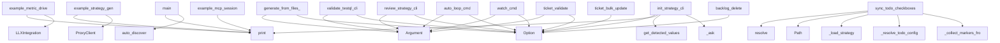

# System Architecture Analysis

## Overview

- **Project**: /home/tom/github/semcod/planfile
- **Primary Language**: python
- **Languages**: python: 149, yaml: 88, shell: 39, json: 9, yml: 2
- **Analysis Mode**: static
- **Total Functions**: 1375
- **Total Classes**: 83
- **Modules**: 293
- **Entry Points**: 1040

## Architecture by Module

### project.map.toon
- **Functions**: 545
- **File**: `map.toon.yaml`

### planfile.testql_integration
- **Functions**: 35
- **File**: `testql_integration.py`

### planfile.analysis.generator
- **Functions**: 24
- **Classes**: 1
- **File**: `generator.py`

### planfile.cli.groups.ticket.commands
- **Functions**: 23
- **File**: `commands.py`

### examples.rest-api.04_javascript_client
- **Functions**: 22
- **Classes**: 1
- **File**: `04_javascript_client.js`

### planfile.sync.base
- **Functions**: 21
- **Classes**: 4
- **File**: `base.py`

### planfile.api.server
- **Functions**: 21
- **Classes**: 7
- **File**: `server.py`

### planfile.dsl.executor
- **Functions**: 21
- **Classes**: 2
- **File**: `executor.py`

### planfile.ticket_validation
- **Functions**: 18
- **File**: `ticket_validation.py`

### examples.ecosystem.01_full_workflow
- **Functions**: 17
- **Classes**: 6
- **File**: `01_full_workflow.sh`

### planfile.sync.operations
- **Functions**: 15
- **File**: `operations.py`

### planfile.loaders.yaml_loader
- **Functions**: 15
- **File**: `yaml_loader.py`

### examples.rest-api.03_python_client
- **Functions**: 14
- **Classes**: 1
- **File**: `03_python_client.py`

### planfile.core.models.strategy
- **Functions**: 14
- **Classes**: 6
- **File**: `strategy.py`

### planfile.integrations.config
- **Functions**: 14
- **Classes**: 1
- **File**: `config.py`

### scripts.run_examples
- **Functions**: 13
- **File**: `run_examples.sh`

### planfile.ci
- **Functions**: 13
- **Classes**: 3
- **File**: `ci.py`

### planfile.sync.jira
- **Functions**: 13
- **Classes**: 1
- **File**: `jira.py`

### planfile.sync.github
- **Functions**: 13
- **Classes**: 1
- **File**: `github.py`

### planfile.core.store
- **Functions**: 13
- **Classes**: 1
- **File**: `store.py`

## Key Entry Points

Main execution flows into the system:

### examples.ecosystem.04_llx_integration.example_metric_driven_planning
> Example: Generate strategy based on actual project metrics.
- **Calls**: Taskfile.print, Taskfile.print, Taskfile.print, LLXIntegration, Taskfile.print, llx.analyze_project, Taskfile.print, Taskfile.print

### examples.ecosystem.03_proxy_routing.example_strategy_generation_with_proxy
> Example: Generate strategy using proxy for smart model routing.
- **Calls**: Taskfile.print, Taskfile.print, Taskfile.print, ProxyClient, Taskfile.print, Taskfile.print, Taskfile.print, enumerate

### planfile.cli.groups.generate.commands.generate_from_files_cmd
> Generate planfile from file analysis (no LLM required).
- **Calls**: typer.Argument, typer.Option, typer.Option, typer.Option, typer.Option, typer.Option, typer.Option, typer.Option

### planfile.cli.groups.validate.commands.validate_testql_cli
> Validate changes via TestQL DSL and optionally generate/sync tickets.
- **Calls**: typer.Argument, typer.Option, typer.Option, typer.Option, typer.Option, typer.Option, typer.Option, typer.Option

### planfile.cli.groups.review.commands.review_strategy_cli
> Review strategy execution and progress.
- **Calls**: typer.Argument, typer.Argument, typer.Option, typer.Option, typer.Option, typer.Option, planfile.cli.groups.review.utils._load_backend_config, planfile.runner.review_strategy

### planfile.cli.groups.auto.commands.auto_loop_cmd
> Run automated CI/CD loop: test → ticket → fix → retest.

This command will:
1. Run tests and code analysis
2. If tests fail, generate bug reports with
- **Calls**: typer.Argument, typer.Argument, typer.Option, typer.Option, typer.Option, typer.Option, typer.Option, typer.Option

### planfile.cli.groups.ticket.commands.ticket_bulk_update
> Bulk update tickets matching filters. Update status, priority, labels, or sprint.
- **Calls**: typer.Option, typer.Option, typer.Option, typer.Option, typer.Option, typer.Option, typer.Option, typer.Option

### examples.python-api.04_analytics_simple.main
> Run simplified analytics examples.
- **Calls**: Taskfile.print, Taskfile.print, Taskfile.print, Planfile.auto_discover, Taskfile.print, pf.store.stats, Taskfile.print, Taskfile.print

### planfile.todo_sync.sync_todo_checkboxes_from_planfile
> Sync TODO.md checkboxes from planfile status and execution results.

Sync is controlled by planfile settings:

integrations:
  markdown:
    sync_on_p
- **Calls**: None.resolve, Path, planfile.todo_sync._load_strategy, planfile.todo_sync._resolve_todo_config, planfile.todo_sync._collect_markers_from_strategy, markers.update, sorted, strategy_file.is_absolute

### planfile.cli.groups.sync.commands.watch_cmd
> Watch .planfile/ directory and auto-sync on changes.
- **Calls**: typer.Argument, typer.Option, typer.Option, typer.Option, typer.Option, IntegrationConfig, config.load_configs, planfile.cli.groups.sync.commands._resolve_watch_integrations

### planfile.cli.groups.init.commands.init_strategy_cli
> Interactive wizard — creates a strategy by asking questions.

No template required. Asks about project type, goals, sprints and quality gates.
Automat
- **Calls**: typer.Option, typer.Option, console.print, planfile.cli.project_detector.main.get_detected_values, planfile.cli.groups.init.commands._ask, planfile.cli.groups.init.commands._ask, planfile.cli.groups.init.commands._choice, planfile.cli.groups.init.commands._ask

### planfile.cli.groups.ticket.commands.ticket_validate
> Validate whether planfile tickets are still current against code and scan data.
- **Calls**: typer.Argument, typer.Option, typer.Option, typer.Option, typer.Option, typer.Option, typer.Option, planfile.cli.groups.ticket.commands._load_issue_records_from_file

### planfile.cli.groups.backlog.commands.backlog_delete
> Delete backlog items from planfile.yaml by filters (files, rule_id).
- **Calls**: typer.Option, typer.Option, typer.Option, typer.Option, typer.Option, planfile.cli.groups.backlog.commands._load_planfile_yaml, data.get, planfile.cli.groups.backlog.commands._collect_backlog_to_delete

### examples.ecosystem.02_mcp_integration.example_mcp_session
> Example of an LLM agent using planfile MCP tools.
- **Calls**: Taskfile.print, Taskfile.print, Taskfile.print, Taskfile.print, Taskfile.print, Taskfile.print, Taskfile.print, examples.ecosystem.02_mcp_integration.run_mcp_tool

### examples.ecosystem.04_llx_integration.LLXIntegration._parse_llx_output
> Parse LLX analysis output.
- **Calls**: None.split, ProjectMetrics, output.strip, line.split, value.strip, int, int, float

### planfile.cli.groups.auto.commands.ci_status_cmd
> Check current CI status without running tests.
- **Calls**: typer.Argument, console.print, results_file.exists, coverage_file.exists, list, json.loads, console.print, console.print

### examples.checkbox-tickets.demo.demo_checkbox_tickets
> Demonstrate checkbox ticket parsing and manipulation.
- **Calls**: console.print, todo_path.exists, console.print, tempfile.NamedTemporaryFile, f.write, Path, MarkdownFileBackend, console.print

### planfile.cli.groups.query.commands.stats_cmd
> Show strategy statistics.
- **Calls**: typer.Argument, planfile.loaders.yaml_loader.load_strategy_yaml, planfile.cli.groups.query.commands.calculate_strategy_stats, Table, table.add_column, table.add_column, table.add_row, table.add_row

### planfile.core.models.strategy.Strategy.merge
> Merge with other strategies to create a combined strategy.
- **Calls**: self.model_dump, set, merged_data.get, Strategy, merged_data.get, all_sprints.append, merged_data.get, all_gates.append

### planfile.cli.groups.ticket.commands.ticket_delete
> Delete tickets by ID(s) or filters (status, sprint, label, source, files).
- **Calls**: typer.Argument, typer.Option, typer.Option, typer.Option, typer.Option, typer.Option, typer.Option, typer.Option

### planfile.cli.groups.validate.commands.validate_strategy_cli
> Validate a strategy YAML file.
- **Calls**: typer.Argument, typer.Option, planfile.loaders.yaml_loader.load_strategy_yaml, console.print, console.print, console.print, console.print, console.print

### planfile.dsl.parser.DSLParser._extract_modifiers
- **Calls**: len, KV_RE.match, KV_RE.match, token.lower, m.group, m.group, token.lower, len

### examples.rest-api.03_python_client.main
> Run all examples.
- **Calls**: Taskfile.print, Taskfile.print, Taskfile.print, os.path.exists, Taskfile.print, Taskfile.print, PlanfileClient, examples.rest-api.03_python_client.example_basic_operations

### planfile.cli.groups.apply.commands.apply_strategy_cli
> Apply a strategy to create tickets.
- **Calls**: typer.Argument, typer.Argument, typer.Option, typer.Option, typer.Option, typer.Option, typer.Option, typer.Option

### planfile.cli.groups.generate.commands.generate_strategy_cli
> Generate strategy.yaml from project analysis + LLM.
- **Calls**: typer.Argument, typer.Option, typer.Option, typer.Option, typer.Option, typer.Option, typer.Option, console.print

### planfile.dsl.executor.DSLExecutor._exec_sync
- **Calls**: cmd.params.get, bool, cmd.params.get, cmd.params.get, IntegrationConfig, cfg.load_configs, DSLResult, planfile.cli.groups.sync.core.sync_integration

### examples.ecosystem.03_proxy_routing.example_budget_tracking
> Example: Budget tracking with proxy.
- **Calls**: Taskfile.print, Taskfile.print, Taskfile.print, ProxyClient, Taskfile.print, Taskfile.print, Taskfile.print, Taskfile.print

### planfile.cli.groups.ticket.commands.ticket_create
> Create a new ticket.
- **Calls**: typer.Argument, typer.Option, typer.Option, typer.Option, typer.Option, typer.Option, typer.Option, typer.Option

### examples.python-api.03_integration_simple.main
> Run simplified integration examples.
- **Calls**: Taskfile.print, Taskfile.print, Taskfile.print, TicketLogger, Taskfile.print, Taskfile.print, logger.metric_alert, Taskfile.print

### planfile.cli.groups.query.commands.compare_cmd
> Compare two strategies.
- **Calls**: typer.Argument, typer.Argument, typer.Option, planfile.loaders.yaml_loader.load_strategy_yaml, planfile.loaders.yaml_loader.load_strategy_yaml, planfile.cli.groups.query.commands.compare_strategies, console.print, Panel

## Process Flows

Key execution flows identified:

### Flow 1: example_metric_driven_planning
```
example_metric_driven_planning [examples.ecosystem.04_llx_integration]
  └─ →> print
  └─ →> print
```

### Flow 2: example_strategy_generation_with_proxy
```
example_strategy_generation_with_proxy [examples.ecosystem.03_proxy_routing]
  └─ →> print
  └─ →> print
```

### Flow 3: generate_from_files_cmd
```
generate_from_files_cmd [planfile.cli.groups.generate.commands]
```

### Flow 4: validate_testql_cli
```
validate_testql_cli [planfile.cli.groups.validate.commands]
```

### Flow 5: review_strategy_cli
```
review_strategy_cli [planfile.cli.groups.review.commands]
```

### Flow 6: auto_loop_cmd
```
auto_loop_cmd [planfile.cli.groups.auto.commands]
```

### Flow 7: ticket_bulk_update
```
ticket_bulk_update [planfile.cli.groups.ticket.commands]
```

### Flow 8: main
```
main [examples.python-api.04_analytics_simple]
  └─ →> print
  └─ →> print
```

### Flow 9: sync_todo_checkboxes_from_planfile
```
sync_todo_checkboxes_from_planfile [planfile.todo_sync]
  └─> _load_strategy
  └─> _resolve_todo_config
```

### Flow 10: watch_cmd
```
watch_cmd [planfile.cli.groups.sync.commands]
```

## Key Classes

### planfile.analysis.generator.PlanfileGenerator
> Generate comprehensive planfile from file analysis.
- **Methods**: 24
- **Key Methods**: planfile.analysis.generator.PlanfileGenerator.__init__, planfile.analysis.generator.PlanfileGenerator._default_limits, planfile.analysis.generator.PlanfileGenerator.generate_with_external_tools, planfile.analysis.generator.PlanfileGenerator._external_to_internal_analysis, planfile.analysis.generator.PlanfileGenerator._extract_external_metrics, planfile.analysis.generator.PlanfileGenerator.generate_from_analysis, planfile.analysis.generator.PlanfileGenerator.generate_from_current_project, planfile.analysis.generator.PlanfileGenerator._extract_key_metrics, planfile.analysis.generator.PlanfileGenerator._generate_goal, planfile.analysis.generator.PlanfileGenerator._generate_goals

### examples.rest-api.04_javascript_client.PlanfileClient
- **Methods**: 21
- **Key Methods**: examples.rest-api.04_javascript_client.PlanfileClient.request, examples.rest-api.04_javascript_client.PlanfileClient.url, examples.rest-api.04_javascript_client.PlanfileClient.response, examples.rest-api.04_javascript_client.PlanfileClient.health, examples.rest-api.04_javascript_client.PlanfileClient.listTickets, examples.rest-api.04_javascript_client.PlanfileClient.createTicket, examples.rest-api.04_javascript_client.PlanfileClient.getTicket, examples.rest-api.04_javascript_client.PlanfileClient.updateTicket, examples.rest-api.04_javascript_client.PlanfileClient.moveTicket, examples.rest-api.04_javascript_client.PlanfileClient.deleteTicket

### planfile.dsl.executor.DSLExecutor
> Execute DSL commands against a Planfile instance.
- **Methods**: 21
- **Key Methods**: planfile.dsl.executor.DSLExecutor.__init__, planfile.dsl.executor.DSLExecutor.pf, planfile.dsl.executor.DSLExecutor.run, planfile.dsl.executor.DSLExecutor.execute, planfile.dsl.executor.DSLExecutor._exec_help, planfile.dsl.executor.DSLExecutor._exec_unknown, planfile.dsl.executor.DSLExecutor._exec_create, planfile.dsl.executor.DSLExecutor._exec_create_sprint, planfile.dsl.executor.DSLExecutor._exec_list, planfile.dsl.executor.DSLExecutor._exec_list_sprints

### planfile.sync.base.BasePMBackend
> Base class for PM backends with common functionality.
- **Methods**: 16
- **Key Methods**: planfile.sync.base.BasePMBackend.__init__, planfile.sync.base.BasePMBackend._validate_config, planfile.sync.base.BasePMBackend.map_priority, planfile.sync.base.BasePMBackend.prepare_metadata, planfile.sync.base.BasePMBackend.create_ticket, planfile.sync.base.BasePMBackend._create_ticket, planfile.sync.base.BasePMBackend.update_ticket, planfile.sync.base.BasePMBackend._update_ticket, planfile.sync.base.BasePMBackend.get_ticket, planfile.sync.base.BasePMBackend._get_ticket
- **Inherits**: ABC

### planfile.integrations.config.IntegrationConfig
> Manages integration configuration with support for multiple config files.
- **Methods**: 14
- **Key Methods**: planfile.integrations.config.IntegrationConfig.__init__, planfile.integrations.config.IntegrationConfig.load_dotenv, planfile.integrations.config.IntegrationConfig._expand_env_vars, planfile.integrations.config.IntegrationConfig.discover_configs, planfile.integrations.config.IntegrationConfig.load_configs, planfile.integrations.config.IntegrationConfig.get_integration_config, planfile.integrations.config.IntegrationConfig.get_project_config, planfile.integrations.config.IntegrationConfig.get_sprint_config, planfile.integrations.config.IntegrationConfig.get_backlog_config, planfile.integrations.config.IntegrationConfig._deep_merge

### planfile.ci.CIRunner
> CI/CD runner with automated bug-fix loop and ticket creation.
- **Methods**: 13
- **Key Methods**: planfile.ci.CIRunner.__init__, planfile.ci.CIRunner._extract_json_object, planfile.ci.CIRunner.run_tests, planfile.ci.CIRunner.run_code_analysis, planfile.ci.CIRunner.generate_bug_report, planfile.ci.CIRunner.create_bug_tickets, planfile.ci.CIRunner._resolve_target_file, planfile.ci.CIRunner._task_patch_applied, planfile.ci.CIRunner._extract_yaml_object, planfile.ci.CIRunner.auto_fix_bugs

### planfile.sync.jira.JiraBackend
> Jira integration backend.
- **Methods**: 13
- **Key Methods**: planfile.sync.jira.JiraBackend.__init__, planfile.sync.jira.JiraBackend._validate_config, planfile.sync.jira.JiraBackend.map_priority, planfile.sync.jira.JiraBackend._map_task_type_to_jira, planfile.sync.jira.JiraBackend._build_metadata_section, planfile.sync.jira.JiraBackend._create_ticket, planfile.sync.jira.JiraBackend._build_update_fields, planfile.sync.jira.JiraBackend._transition_issue, planfile.sync.jira.JiraBackend._update_ticket, planfile.sync.jira.JiraBackend._get_ticket
- **Inherits**: BasePMBackend

### planfile.sync.github.GitHubBackend
> GitHub Issues integration backend.
- **Methods**: 13
- **Key Methods**: planfile.sync.github.GitHubBackend.__init__, planfile.sync.github.GitHubBackend._validate_config, planfile.sync.github.GitHubBackend._ensure_labels_exist, planfile.sync.github.GitHubBackend._prepare_labels, planfile.sync.github.GitHubBackend._build_metadata_body, planfile.sync.github.GitHubBackend._create_ticket, planfile.sync.github.GitHubBackend._update_labels, planfile.sync.github.GitHubBackend._update_issue_state, planfile.sync.github.GitHubBackend._update_ticket, planfile.sync.github.GitHubBackend._get_ticket
- **Inherits**: BasePMBackend

### planfile.core.store.Store
> File-based ticket store using .planfile/ directory.
- **Methods**: 13
- **Key Methods**: planfile.core.store.Store.__init__, planfile.core.store.Store.is_initialized, planfile.core.store.Store.init, planfile.core.store.Store._read_config, planfile.core.store.Store._write_config, planfile.core.store.Store.next_id, planfile.core.store.Store._sprint_file, planfile.core.store.Store._all_sprint_files, planfile.core.store.Store.create_ticket, planfile.core.store.Store.get_ticket
- **Inherits**: StoreFileMixin, TicketStoreMixin

### planfile.sync.gitlab.GitLabBackend
> GitLab Issues integration backend.
- **Methods**: 12
- **Key Methods**: planfile.sync.gitlab.GitLabBackend.__init__, planfile.sync.gitlab.GitLabBackend._validate_config, planfile.sync.gitlab.GitLabBackend._prepare_labels, planfile.sync.gitlab.GitLabBackend._build_metadata_body, planfile.sync.gitlab.GitLabBackend._create_ticket, planfile.sync.gitlab.GitLabBackend._update_labels, planfile.sync.gitlab.GitLabBackend._update_state, planfile.sync.gitlab.GitLabBackend._update_ticket, planfile.sync.gitlab.GitLabBackend._get_ticket, planfile.sync.gitlab.GitLabBackend._issue_to_ticket_status
- **Inherits**: BasePMBackend

### planfile.analysis.external_tools.ExternalToolRunner
> Runner for external code analysis tools.
- **Methods**: 11
- **Key Methods**: planfile.analysis.external_tools.ExternalToolRunner.__init__, planfile.analysis.external_tools.ExternalToolRunner.run_all, planfile.analysis.external_tools.ExternalToolRunner.run_code2llm, planfile.analysis.external_tools.ExternalToolRunner.run_vallm, planfile.analysis.external_tools.ExternalToolRunner.run_redup, planfile.analysis.external_tools.ExternalToolRunner.parse_code2llm_output, planfile.analysis.external_tools.ExternalToolRunner.parse_vallm_output, planfile.analysis.external_tools.ExternalToolRunner.parse_redup_output, planfile.analysis.external_tools.ExternalToolRunner._mock_code2llm_data, planfile.analysis.external_tools.ExternalToolRunner._mock_vallm_data

### planfile.sync.generic.GenericBackend
> Generic HTTP API backend for PM systems.
- **Methods**: 10
- **Key Methods**: planfile.sync.generic.GenericBackend.__init__, planfile.sync.generic.GenericBackend._validate_config, planfile.sync.generic.GenericBackend._make_request, planfile.sync.generic.GenericBackend._create_ticket, planfile.sync.generic.GenericBackend._update_ticket, planfile.sync.generic.GenericBackend._build_update_data, planfile.sync.generic.GenericBackend._get_ticket, planfile.sync.generic.GenericBackend._list_tickets, planfile.sync.generic.GenericBackend._search_tickets, planfile.sync.generic.GenericBackend._ticket_data_to_status
- **Inherits**: BasePMBackend

### planfile.analysis.file_analyzer.FileAnalyzer
> Analyzes YAML/JSON files to extract issues and metrics.
- **Methods**: 10
- **Key Methods**: planfile.analysis.file_analyzer.FileAnalyzer.__init__, planfile.analysis.file_analyzer.FileAnalyzer.analyze_file, planfile.analysis.file_analyzer.FileAnalyzer._analyze_toon, planfile.analysis.file_analyzer.FileAnalyzer._analyze_yaml, planfile.analysis.file_analyzer.FileAnalyzer._analyze_json, planfile.analysis.file_analyzer.FileAnalyzer._analyze_text, planfile.analysis.file_analyzer.FileAnalyzer._extract_from_yaml_structure, planfile.analysis.file_analyzer.FileAnalyzer._extract_from_json_structure, planfile.analysis.file_analyzer.FileAnalyzer.analyze_directory, planfile.analysis.file_analyzer.FileAnalyzer._generate_summary

### planfile.analysis.sprint_generator.SprintGenerator
> Generates sprints and tickets from extracted information.
- **Methods**: 10
- **Key Methods**: planfile.analysis.sprint_generator.SprintGenerator.__init__, planfile.analysis.sprint_generator.SprintGenerator.generate_sprints, planfile.analysis.sprint_generator.SprintGenerator._group_issues_by_priority, planfile.analysis.sprint_generator.SprintGenerator._get_high_and_quality_issues, planfile.analysis.sprint_generator.SprintGenerator._get_remaining_medium_issues, planfile.analysis.sprint_generator.SprintGenerator._create_sprint, planfile.analysis.sprint_generator.SprintGenerator._map_category_to_task_type, planfile.analysis.sprint_generator.SprintGenerator._get_highest_priority, planfile.analysis.sprint_generator.SprintGenerator._estimate_effort, planfile.analysis.sprint_generator.SprintGenerator.generate_tickets

### planfile.core.models.strategy.Strategy
> Main strategy configuration - simplified and more flexible.
- **Methods**: 10
- **Key Methods**: planfile.core.models.strategy.Strategy.get_task_patterns, planfile.core.models.strategy.Strategy.get_sprint, planfile.core.models.strategy.Strategy.validate_sprint_ids, planfile.core.models.strategy.Strategy.compare, planfile.core.models.strategy.Strategy.merge, planfile.core.models.strategy.Strategy.export, planfile.core.models.strategy.Strategy._count_task_types, planfile.core.models.strategy.Strategy._collect_durations, planfile.core.models.strategy.Strategy.get_stats, planfile.core.models.strategy.Strategy.to_yaml
- **Inherits**: BaseModel

### examples.rest-api.03_python_client.PlanfileClient
> Python client for planfile REST API.
- **Methods**: 9
- **Key Methods**: examples.rest-api.03_python_client.PlanfileClient.__init__, examples.rest-api.03_python_client.PlanfileClient._request, examples.rest-api.03_python_client.PlanfileClient.health, examples.rest-api.03_python_client.PlanfileClient.list_tickets, examples.rest-api.03_python_client.PlanfileClient.create_ticket, examples.rest-api.03_python_client.PlanfileClient.get_ticket, examples.rest-api.03_python_client.PlanfileClient.update_ticket, examples.rest-api.03_python_client.PlanfileClient.move_ticket, examples.rest-api.03_python_client.PlanfileClient.delete_ticket

### planfile.Planfile
> Main entry point — convenience wrapper around PlanfileStore.
- **Methods**: 9
- **Key Methods**: planfile.Planfile.__init__, planfile.Planfile.auto_discover, planfile.Planfile.create_ticket, planfile.Planfile.get_ticket, planfile.Planfile.list_tickets, planfile.Planfile.update_ticket, planfile.Planfile.delete_ticket, planfile.Planfile.delete_tickets, planfile.Planfile.create_tickets_bulk

### planfile.sync.markdown_backend.backend.MarkdownFileBackend
> Backend for managing tickets in CHANGELOG.md and TODO.md files.
- **Methods**: 8
- **Key Methods**: planfile.sync.markdown_backend.backend.MarkdownFileBackend.__init__, planfile.sync.markdown_backend.backend.MarkdownFileBackend._create_ticket, planfile.sync.markdown_backend.backend.MarkdownFileBackend._update_ticket, planfile.sync.markdown_backend.backend.MarkdownFileBackend._get_ticket, planfile.sync.markdown_backend.backend.MarkdownFileBackend._list_tickets, planfile.sync.markdown_backend.backend.MarkdownFileBackend._search_tickets, planfile.sync.markdown_backend.backend.MarkdownFileBackend._find_ticket_file, planfile.sync.markdown_backend.backend.MarkdownFileBackend._scan_ticket_ids
- **Inherits**: MarkdownFileManager, MarkdownTicketHelpers, BasePMBackend

### planfile.core.store_tickets.TicketStoreMixin
- **Methods**: 8
- **Key Methods**: planfile.core.store_tickets.TicketStoreMixin._ticket_from_data, planfile.core.store_tickets.TicketStoreMixin._tickets_from_sprint_data, planfile.core.store_tickets.TicketStoreMixin._filter_by_files, planfile.core.store_tickets.TicketStoreMixin._filter_by_labels, planfile.core.store_tickets.TicketStoreMixin._filter_by_attribute, planfile.core.store_tickets.TicketStoreMixin._apply_filters, planfile.core.store_tickets.TicketStoreMixin._matches_files, planfile.core.store_tickets.TicketStoreMixin.list_tickets

### planfile.importers.vallm_importer.VallmParser
> Parser for vallm validation.toon files.
- **Methods**: 8
- **Key Methods**: planfile.importers.vallm_importer.VallmParser.__init__, planfile.importers.vallm_importer.VallmParser.parse, planfile.importers.vallm_importer.VallmParser._process_line, planfile.importers.vallm_importer.VallmParser._is_file_entry, planfile.importers.vallm_importer.VallmParser._is_issue_entry, planfile.importers.vallm_importer.VallmParser._parse_file_entry, planfile.importers.vallm_importer.VallmParser._parse_issue_entry, planfile.importers.vallm_importer.VallmParser._determine_priority

## Data Transformation Functions

Key functions that process and transform data:

### examples.llx_validator.LLXValidator.validate_strategy
> Validate a strategy file using LLX.
- **Output to**: self._is_llx_available, subprocess.run, str, str

### examples.llx_validator.LLXValidator._parse_llx_analysis
> Parse LLX analysis output.
- **Output to**: None.split, output.strip, line.split, value.strip, key.strip

### examples.validate_with_llx.validate_file

### examples.ecosystem.04_llx_integration.LLXIntegration._parse_llx_output
> Parse LLX analysis output.
- **Output to**: None.split, ProjectMetrics, output.strip, line.split, value.strip

### examples.bash-generation.verify_planfile.validate_planfile

### scripts.docker-entrypoint.validate_config

### planfile.examples.example_validate_strategy
> Load and validate an existing strategy.
- **Output to**: planfile.runner.load_valid_strategy, Taskfile.print, Taskfile.print, Taskfile.print, len

### planfile.ticket_validation._parse_positive_int
- **Output to**: int

### planfile.ticket_validation._validate_rule_anchor
- **Output to**: any

### planfile.ticket_validation._validate_line_anchor
- **Output to**: planfile.ticket_validation._resolve_existing_files, all, any

### planfile.ticket_validation._validate_file_only
- **Output to**: any, None.exists

### planfile.ticket_validation._validate_ticket
- **Output to**: planfile.ticket_validation._resolve_ticket_id, None.strip, planfile.ticket_validation._normalize_rule, planfile.ticket_validation._normalize_files, planfile.ticket_validation._parse_positive_int

### planfile.ticket_validation.validate_planfile_tickets
> Validate ticket freshness and return a structured report.

Args:
    strategy_path: Path to a planfi
- **Output to**: None.resolve, Path, planfile.ticket_validation._load_strategy, planfile.ticket_validation._collect_ticket_entries, planfile.ticket_validation._normalize_ticket_filters

### planfile.sync.base.BasePMBackend._validate_config
> Validate backend configuration.

### planfile.sync.gitlab.GitLabBackend._validate_config
> Validate GitLab configuration.
- **Output to**: self.config.get, ValueError, self.config.get, ValueError

### planfile.sync.jira.JiraBackend._validate_config
> Validate Jira configuration.
- **Output to**: self.config.get, ValueError, self.config.get, ValueError, self.config.get

### planfile.sync.utils.save_v1_format
> Save data back to v1 format YAML file.
- **Output to**: open, yaml.dump

### planfile.sync.github.GitHubBackend._validate_config
> Validate GitHub configuration.
- **Output to**: self.config.get, ValueError, self.config.get, ValueError, ValueError

### planfile.sync.operations._process_external_ticket
> Process a single external ticket. Returns updated (imported_count, updated_count).
- **Output to**: planfile.sync.operations._extract_ticket_data, sync_state.get_local_id, planfile.sync.operations._print_dry_run_action, console.print, planfile.sync.operations._update_local_ticket

### planfile.sync.generic.GenericBackend._validate_config
> Validate generic backend configuration.
- **Output to**: self.config.get, ValueError

### planfile.sync.markdown_backend.tickets.MarkdownTicketHelpers._format_ticket_entry
- **Output to**: None.get, lines.append, lines.append, lines.append, lines.append

### planfile.loaders.yaml_loader._transform_task_patterns
> Transform task patterns in the data.
- **Output to**: None.items, ModelHints, TaskType

### planfile.loaders.yaml_loader._transform_sprints
> Transform sprints in the data.

### planfile.loaders.yaml_loader._transform_goal
> Transform goal field in the data.
- **Output to**: isinstance, isinstance, Goal

### planfile.loaders.yaml_loader._format_validation_error
> Format validation error with context.
- **Output to**: hasattr, callable, e.errors, ValueError, ValueError

## Behavioral Patterns

### recursion_load_dotenv
- **Type**: recursion
- **Confidence**: 0.90
- **Functions**: planfile.integrations.config.IntegrationConfig.load_dotenv

### state_machine_SyncState
- **Type**: state_machine
- **Confidence**: 0.70
- **Functions**: planfile.sync.state.SyncState.__init__, planfile.sync.state.SyncState.get_last_sync, planfile.sync.state.SyncState.save_sync, planfile.sync.state.SyncState.get_remote_id, planfile.sync.state.SyncState.get_local_id

### state_machine_ConnectionManager
- **Type**: state_machine
- **Confidence**: 0.70
- **Functions**: planfile.api.server.ConnectionManager.__init__, planfile.api.server.ConnectionManager.connect, planfile.api.server.ConnectionManager.disconnect, planfile.api.server.ConnectionManager.broadcast

## Public API Surface

Functions exposed as public API (no underscore prefix):

- `examples.ecosystem.04_llx_integration.example_metric_driven_planning` - 57 calls
- `examples.ecosystem.03_proxy_routing.example_strategy_generation_with_proxy` - 56 calls
- `planfile.cli.groups.examples.commands.create_examples_app` - 46 calls
- `planfile.cli.groups.generate.commands.generate_from_files_cmd` - 46 calls
- `planfile.cli.groups.validate.commands.validate_testql_cli` - 43 calls
- `planfile.mcp.server.handle_tool_call` - 42 calls
- `planfile.cli.groups.review.commands.review_strategy_cli` - 40 calls
- `planfile.cli.groups.auto.commands.auto_loop_cmd` - 38 calls
- `planfile.cli.groups.ticket.commands.ticket_bulk_update` - 37 calls
- `examples.python-api.04_analytics_simple.main` - 35 calls
- `planfile.testql_integration.upsert_testql_tickets` - 31 calls
- `planfile.todo_sync.sync_todo_checkboxes_from_planfile` - 30 calls
- `planfile.analysis.parsers.text_parser.analyze_text` - 30 calls
- `planfile.cli.groups.sync.commands.watch_cmd` - 29 calls
- `planfile.cli.groups.init.commands.init_strategy_cli` - 29 calls
- `planfile.cli.groups.health.commands.create_health_app` - 28 calls
- `planfile.cli.groups.ticket.commands.ticket_validate` - 28 calls
- `planfile.cli.groups.backlog.commands.backlog_delete` - 27 calls
- `examples.ecosystem.02_mcp_integration.example_mcp_session` - 26 calls
- `planfile.cli.groups.auto.commands.ci_status_cmd` - 26 calls
- `examples.checkbox-tickets.demo.demo_checkbox_tickets` - 25 calls
- `planfile.runner.analyze_project_metrics` - 25 calls
- `planfile.cli.groups.query.commands.stats_cmd` - 24 calls
- `planfile.testql_integration.run_testql_validation` - 23 calls
- `planfile.runner.run_strategy` - 23 calls
- `planfile.core.models.strategy.Strategy.merge` - 23 calls
- `planfile.cli.groups.ticket.commands.ticket_delete` - 23 calls
- `planfile.cli.groups.query.commands.compare_strategies` - 22 calls
- `planfile.cli.groups.validate.commands.validate_strategy_cli` - 22 calls
- `examples.rest-api.03_python_client.main` - 21 calls
- `planfile.analysis.parsers.yaml_parser.analyze_yaml` - 20 calls
- `planfile.cli.groups.apply.commands.apply_strategy_cli` - 20 calls
- `planfile.cli.groups.generate.commands.generate_strategy_cli` - 20 calls
- `examples.ecosystem.03_proxy_routing.example_budget_tracking` - 19 calls
- `planfile.cli.groups.ticket.commands.ticket_create` - 19 calls
- `examples.python-api.03_integration_simple.main` - 18 calls
- `planfile.ticket_validation.validate_planfile_tickets` - 18 calls
- `planfile.cli.groups.query.commands.compare_cmd` - 18 calls
- `examples.rest-api.04_javascript_client.BASE_URL` - 17 calls
- `examples.python-api.04_advanced_filtering.example_statistics` - 17 calls

## System Interactions

How components interact:


```mermaid
graph TD
    example_metric_drive --> print
    example_metric_drive --> LLXIntegration
    example_strategy_gen --> print
    example_strategy_gen --> ProxyClient
    generate_from_files_ --> Argument
    generate_from_files_ --> Option
    validate_testql_cli --> Argument
    validate_testql_cli --> Option
    review_strategy_cli --> Argument
    review_strategy_cli --> Option
    auto_loop_cmd --> Argument
    auto_loop_cmd --> Option
    ticket_bulk_update --> Option
    main --> print
    main --> auto_discover
    sync_todo_checkboxes --> resolve
    sync_todo_checkboxes --> Path
    sync_todo_checkboxes --> _load_strategy
    sync_todo_checkboxes --> _resolve_todo_config
    sync_todo_checkboxes --> _collect_markers_fro
    watch_cmd --> Argument
    watch_cmd --> Option
    init_strategy_cli --> Option
    init_strategy_cli --> print
    init_strategy_cli --> get_detected_values
    init_strategy_cli --> _ask
    ticket_validate --> Argument
    ticket_validate --> Option
    backlog_delete --> Option
    example_mcp_session --> print
```

## Reverse Engineering Guidelines

1. **Entry Points**: Start analysis from the entry points listed above
2. **Core Logic**: Focus on classes with many methods
3. **Data Flow**: Follow data transformation functions
4. **Process Flows**: Use the flow diagrams for execution paths
5. **API Surface**: Public API functions reveal the interface

## Context for LLM

Maintain the identified architectural patterns and public API surface when suggesting changes.